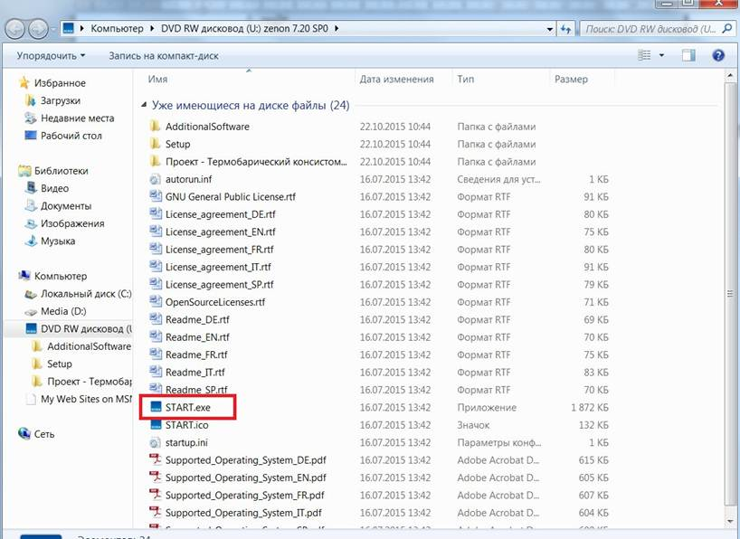
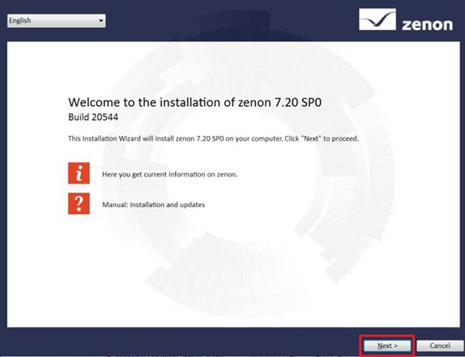
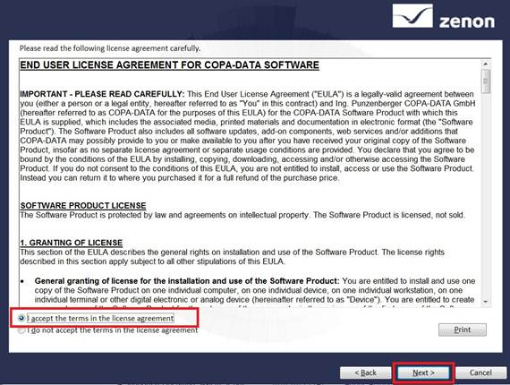
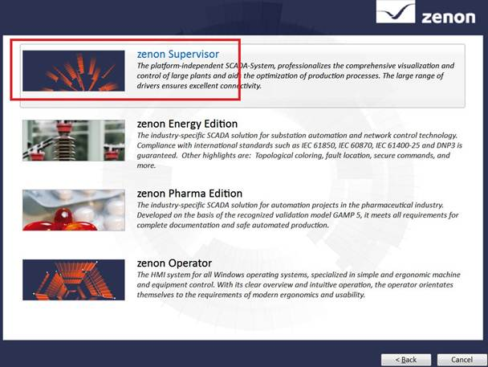

# zenon ЛР1: Загальні положення і підготовка робочого місця

## 1. Про лабораторний практикум

Додаткові матеріали по zenon можна знайти на сайті http://www.copa-data.com.ua/. Офіційним дистрибутором компанії COPA DATA в Україні є компанія [СВ Альтера ](http://www.svaltera.ua/) У підготовці лабораторного практику брали участь: Олександр Пупена (ІАСУ НУХТ), Альона Бирченко (ІАСУ, АКС). Спасибі Олександру Голінько (СВ Альтера) за сприяння в підготовці курсу.

Ці матеріали  познайомлять Вас з базовими можливостями системи керування та навчать  створювати нескладні проекти візуалізації виробничих операцій. Тут розглянуті найбільш  важливі етапи проектування, такі як розробка екранів мнемосхем,  елементів керування, ведення архівів, адміністрування користувачів та  багато інших моментів з якими стикається інженер під час створення систем моніторингу та диспетчеризації.

## 2. Знайомство з системою

Концептуально SCADA zenon представляє собою  програмно-технічний комплекс який складається з середовища розроблення  проектів – Editor та середовища виконання – Runtime. Це дві незалежні  оболонки, які виконують кожна свою функцію і можуть встановлюватися на  робочу станцію окремо одна від одної. Середовище розроблення містить набір модулів та  інструментів необхідних для написання повнофункціональних програм і  пакет драйверів для підключення до найбільш розповсюджених апаратних  засобів. Воно потрібне для встановлення на робочі станції розробників. Середовище виконання встановлюється на робочі станції операторів і лише виконує розроблений проект. Для перевірки працездатності проекту середовище розроблення включає також середовище виконання.  

У лабораторній роботі використовується версія SCADA  zenon 7.2. Наразі є новіші версії, однак для навчальних цілей цієї версії буде достатньо. 

Відповідно до задач, які необхідно вирішувати, SCADA zenon 7.2 має чотири редакції:

| Реадакція                | Пояснення                                                    |
| ------------------------ | ------------------------------------------------------------ |
| **zenon Operator**       | HMI-cистема, призначена для створення нескладних проектів візуалізації для панелей оператора, вбудованих  систем та локальних диспетчерських пунктів на ПК з певними  функціональними обмеженнями. |
| **zenon Supervisor**     | Незалежна SCADA-система, яка містить  повний набір функцій для реалізації диспетчерського керування та збору  даних. Ефективно вирішує задачі побудови систем автоматизації будь-які  складності. |
| **zenon Energy Edition** | Спеціальна редакція системи, яка містить додатковий набір функцій для енергетичної промисловості. |
| **zenon Pharma Edition** | Спеціальна редакція системи, яка містить додатковий набір функцій для фармацевтичної промисловості. |

Вибір необхідної редакції здійснюється на етапі всатновлення системи.  Для цього курсу буде використовуватися редакція **zenon Supervisor**.

Система ліцензується по кількості змінних вводу/виводу та тих додаткових модулів, які використовуються в проекті і не  входять в базову поставку. Оскільки в навчальному курсі не потребується ліцензія, то програма (Editor\Runtime) після установки запуститься в DEMO-режимі. Єдина відмінність ліцензованої версії від  демонстраційної – це часові обмеження що накладаються на систему. Перші 40 запусків програма буде працювати 30 хвилин, після чого час  безперебійної роботи урізається до 10 хвилин. По закінченню визначеного  часу, з’явиться відповідне повідомлення і система буде закрита. Проект,  який розробляв користувач, повністю зберігається. Для продовження роботи необхідно повторно запустити систему. Можна по завершенню роботи системи обновити 40 запусків через запуск правки реєстру - [Файл правки реєстру Windows для продовження терміну використання](https://drive.google.com/file/d/1M5w_6olgWqwoOlEewe6R7PKCt1O66jXT/view?usp=sharing)(для вер.7.2).  

## 3. Інсталяція середовища розроблення SCADA zenon

Комп’ютер, на який буде інсталюватися програмне забезпечення SCADA zenon 7.20 повинен відповідати наступним вимогам:

|      | Мінімальні           | Рекомендовані         |
| ---- | -------------------- | --------------------- |
| ОС   | Windows 7            | Windows 7 або новіша  |
| CPU  | Pentium 4            | Quad Core             |
| RAM  | 2 GB                 | 4 GB                  |
| HD   | 25 GB вільного місця | 200 GB вільного місця |

Якщо ваша система та ресурси не відповідають наведеним в таблиці,  можете використовувати більш старіші версії. При цьому деякі пункти  практикуму будуть виконуватися дещо іншим способом. 

**Завдання 1.1: Інсталюйте середовище розроблення разом з середовищем виконання.** 

- Завантажте дистрибутив SCADA [zenon 7.2](http://download.copadata.com/fileadmin/user_upload/Downloads/installation_cd/zenon_720/SP0B20544/zenon720SP0_LanguageBuild20544_COPA-DATA.iso) або SCADA [zenon 7.6](http://download.copadata.com/fileadmin/user_upload/Downloads/installation_cd/zenon_720/SP0B20544/zenon720SP0_LanguageBuild20544_COPA-DATA.iso). Дана версія потребує ОС Windows 7 та вище. **Увага! Лабораторний практикум розроблений для  SCADA zenon 7.2, у версії 7.6. можуть бути відмінності!**  
- Відкрийте образ і скопіюйте усі файли в окрему папку. 

- Запустіть процес установки системи за допомогою файлу “START.exe”.

- У вікні, що з’явилось натисніть кнопку “Next”.

- Прийміть умови ліцензійної угоди і натисніть кнопку “Next”.

- Виберіть інсталяцію середовища розробки проекту **zenon Editor**
- У наступному вікні виберіть версію **zenon Supervisor**.

- На завершальному етапі виберіть пункт *Install now* та завершіть встановлення

## 4. Перший запуск системи

