[На основну сторінку курсу](../../README.md)     [До списку лабораторних](../README.md)

# Лабораторна робота №1

**Тема. Загальні положення, і середовище виконання**

**Тривалість**: 4 акад. години (2 пари).

**Мета:** підготовка робочого місця, ознайомлення з можливостями середовищ виконання SCADA на базі zenon

**Цілі.** 

1. Встановити середовище розроблення та виконання SCADA zenon 

2. Навчитися запускати, зупиняти, перезапускати середовище виконання  SCADA zenon . 

3. На прикладі демонстраційного проекту ознайомитися з основними можливостями середовища виконання: анімацією, тривоговими екранами, трендами та інш.

У цьому лабораторному практикумі Ви познайомитеся з базовими можливостями системи керування та навчитеся створювати нескладні проекти візуалізації виробничих операцій. Тут розглянуті найбільш  важливі етапи проектування, такі як розробка екранів мнемосхем, елементів керування, ведення архівів, адміністрування користувачів та  багато інших моментів з якими стикається інженер під час створення систем моніторингу та диспетчеризації. Дана лабораторна робота дає можливість ознайомитися з основними можливостями середовища виконання з точки зору користувача а не розробника. 

Концептуально SCADA zenon представляє собою  програмно-технічний комплекс який складається з середовища розроблення  проектів – Editor та середовища виконання – Runtime. Це дві незалежні  оболонки, які виконують кожна свою функцію і можуть встановлюватися на  робочу станцію окремо одна від одної. Середовище розроблення містить набір модулів та  інструментів необхідних для написання повнофункціональних програм і  пакет драйверів для підключення до найбільш розповсюджених апаратних  засобів. Воно потрібне для встановлення на робочі станції розробників. Середовище виконання встановлюється на робочі станції операторів і лише виконує розроблений проект. Для перевірки працездатності проекту середовище розроблення включає також середовище виконання.  

У лабораторній роботі використовується версія SCADA  zenon 7.2. Наразі є новіші версії, однак для навчальних цілей цієї версії буде достатньо. Відповідно до задач, які необхідно вирішувати, SCADA zenon 7.2 має чотири редакції:

| Реадакція                | Пояснення                                                    |
| ------------------------ | ------------------------------------------------------------ |
| **zenon Operator**       | HMI-cистема, призначена для створення нескладних проектів візуалізації для панелей оператора, вбудованих  систем та локальних диспетчерських пунктів на ПК з певними  функціональними обмеженнями. |
| **zenon Supervisor**     | Незалежна SCADA-система, яка містить  повний набір функцій для реалізації диспетчерського керування та збору  даних. Ефективно вирішує задачі побудови систем автоматизації будь-які  складності. |
| **zenon Energy Edition** | Спеціальна редакція системи, яка містить додатковий набір функцій для енергетичної промисловості. |
| **zenon Pharma Edition** | Спеціальна редакція системи, яка містить додатковий набір функцій для фармацевтичної промисловості. |

Вибір необхідної редакції здійснюється на етапі всатновлення системи.  Для цього курсу буде використовуватися редакція **zenon Supervisor**.

Система ліцензується по кількості змінних вводу/виводу та тих додаткових модулів, які використовуються в проекті і не  входять в базову поставку. Оскільки в навчальному курсі не потребується ліцензія, то програма (Editor\Runtime) після установки запуститься в DEMO-режимі. Єдина відмінність ліцензованої версії від  демонстраційної – це часові обмеження що накладаються на систему. Перші 40 запусків програма буде працювати 30 хвилин, після чого час  безперебійної роботи урізається до 10 хвилин. По закінченню визначеного  часу, з’явиться відповідне повідомлення і система буде закрита. Проект,  який розробляв користувач, повністю зберігається. Для продовження роботи необхідно повторно запустити систему. Можна по завершенню роботи системи обновити 40 запусків через запуск правки реєстру - [Файл правки реєстру Windows для продовження терміну використання](https://drive.google.com/file/d/1M5w_6olgWqwoOlEewe6R7PKCt1O66jXT/view?usp=sharing)(для вер.7.2).  

Додаткові матеріали по zenon можна знайти на сайті http://www.copa-data.com.ua/. Офіційним дистрибутором компанії COPA DATA в Україні є компанія [СВ Альтера ](http://www.svaltera.ua/) У підготовці лабораторного практику брали участь: Олександр Пупена (АКТСУ НУХТ), Альона Бирченко (колишня студентка тепер випускниця АКС). Спасибі Олександру Голінько (СВ Альтера) за сприяння в підготовці курсу.

**Лабораторна установка**

- Апаратне забезпечення: ПК. 

- Програмне забезпечення: SCADA zenon.

## Порядок виконання роботи 

### 1. Встановлення середовища розроблення SCADA zenon

Комп’ютер, на який буде інсталюватися програмне забезпечення SCADA zenon 7.20 повинен відповідати наступним вимогам:

|      | Мінімальні           | Рекомендовані         |
| ---- | -------------------- | --------------------- |
| ОС   | Windows 7            | Windows 7 або новіша  |
| CPU  | Pentium 4            | Quad Core             |
| RAM  | 2 GB                 | 4 GB                  |
| HD   | 25 GB вільного місця | 200 GB вільного місця |

#### Завдання 1.1: Інсталювання середовища розроблення 

 Інсталюйте середовище розроблення разом з середовищем виконання.

- Завантажте дистрибутив SCADA [zenon 7.2](http://download.copadata.com/fileadmin/user_upload/Downloads/installation_cd/zenon_720/SP0B20544/zenon720SP0_LanguageBuild20544_COPA-DATA.iso) або SCADA [zenon 7.6](http://download.copadata.com/fileadmin/user_upload/Downloads/installation_cd/zenon760/SP0B36068/zenon760_FinalBuild36068_COPA-DATA.iso). Дана версія потребує ОС Windows 7 та вище. **Увага! Лабораторний практикум розроблений для  SCADA zenon 7.2, у версії 7.6. можуть бути відмінності!**  
- Відкрийте образ і скопіюйте усі файли в окрему папку. 

- Запустіть процес установки системи за допомогою файлу “START.exe”.

рис.1.1.

- У вікні, що з’явилось натисніть кнопку “Next”.

рис.1.2

- Прийміть умови ліцензійної угоди і натисніть кнопку “Next”.

рис.1.3

- Виберіть інсталяцію середовища розробки проекту **zenon Editor**
- У наступному вікні виберіть версію **zenon Supervisor**.

рис.1.4.

- На завершальному етапі виберіть пункт *Install now* та завершіть встановлення

### 2. Перший запуск системи

#### Завдання 1.2: Запуск середовища розроблення та виконання

- Запустіть zenon Startup Tool
- У командах Start виберіть `Start 32-bit zenon Editor`

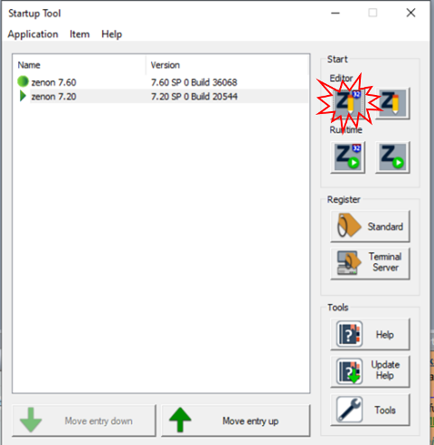

рис.1.5.

- Вийде пропозиція запустити середовище розроблення в демо-режимі, зробіть підтвердження
- Повинно автоматично завантажитися робоче середовище DEMO720 та проект SUPERVISOR720 (рис.1.6)
- Викличте контекстне меню проекту (натисніть праву кнопку миші на проект), проконтролюйте щоб там стояли опції `Set project as start project` та `Activate project` , якщо не стоять - виставте їх.   

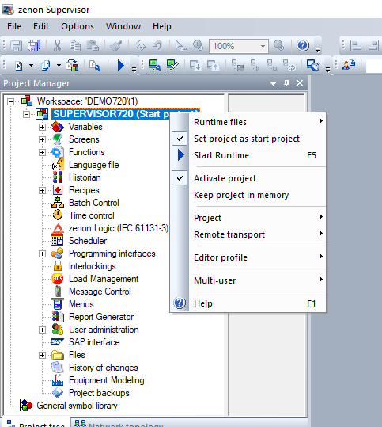

рис.1.6.

- Натисніть кнопку Start Runtime 
- Вийде пропозиція запустити середовище виконання в демо-режимі, зробіть підтвердження
- Перший раз при запуску необхідно підтвердити доступ до портів (рис.1.8)

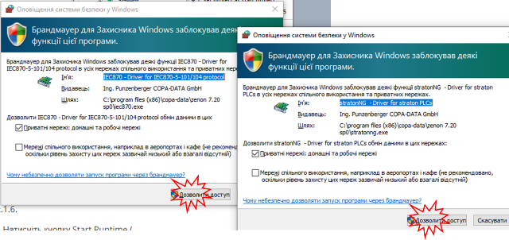

рис.1.8

- З'явиться основна сторінка демопроекту, в якому можна перейти на різні демонстраційні частини проекту (рис.1.9)

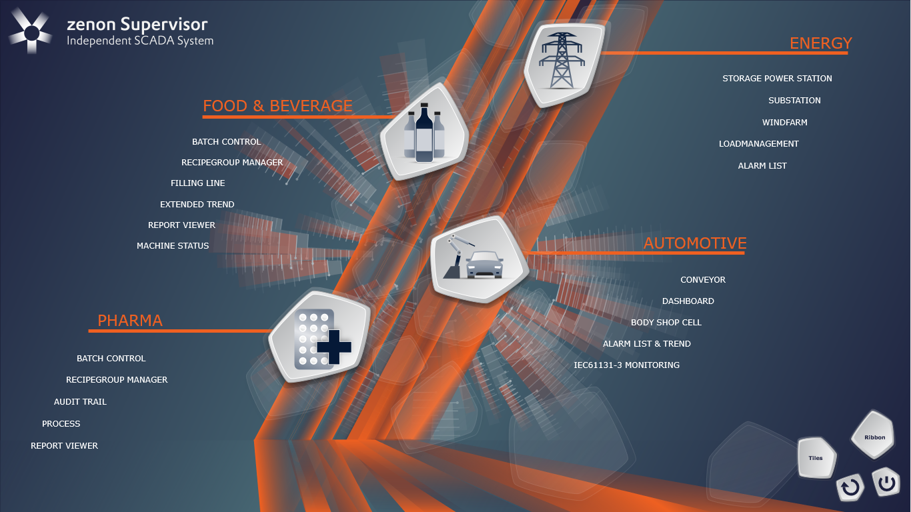

рис.1.9 

### 3. Ознайомлення з людино-машинним інтерфейсом моніторингу процесу

#### Завдання 1.3: Ознайомлення з процесом FOOD & BEVERAGE  

- У розіділ FOOD & BEVERAGE відкрийте сторінку FILLING LINE 
- Проаналізуйте процес зображений на схемі, яке обладнання там зображено (рис.1.10)

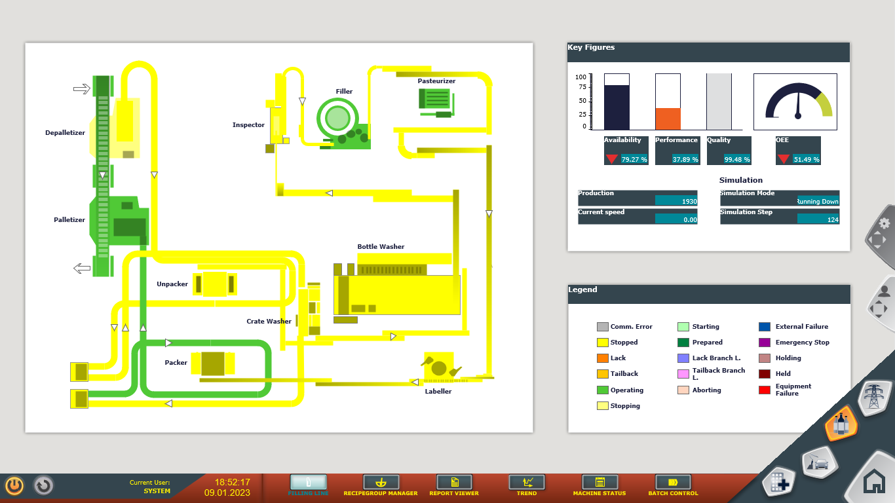

рис.1.10

- змініть мову інтерфейсу на іншу, яка вам буде зозуміліша, для чого витягніть панель зміни інтерфейсу (рис.1.11) і натисність відповідний прапор

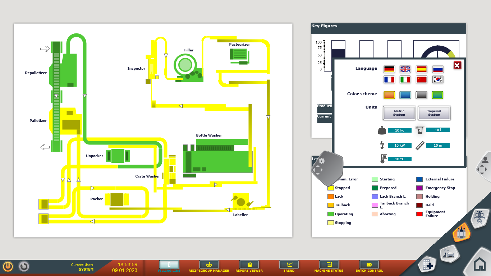

рис.1.11

- на тій же закладці змініть одиниці вимірювання (Units)
- на тій же закладці змініть кольорову тему (Color Scheme) 
- сховайте панель зміни інтерфейсу
- проаналізуйте стан обладнання на лінії використовуючи позначення кольору легенди
- подивіться на ключові показники на панелі Key Figures, там зображені ключові показники ефективності:
  - availability - доступність
  - performance - продуктивність
  - quality - якість
  - OEE - загальний показник ефективності

#### Завдання 1.4: Зареєструватися як адміністратор  

- витягніть панель зміни користувача, зереєструйтеся як оператор, для цього достатньо натиснути кнопку `Operator`  (рис.1.12)

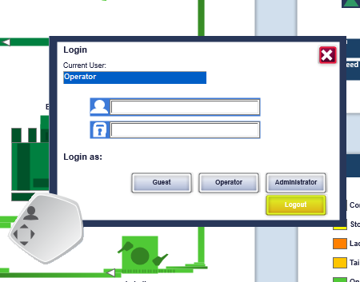

рис.1.12.

- зверніть увагу на те, що змінився напис в полі Current User

#### Завдання 1.5: Ознайомлення з процесом Pharma   

- Перейдіть на основну сторінку через кнопку Home (зображення будинку)
- Проаналізуйте процес зображений на схемі, яке обладнання там зображено (рис.1.13), виділіть яким чином відображаються наступні параметри:
  - рівні в збірниках
  - температура, тиск, швидкість
  - стан обладнання

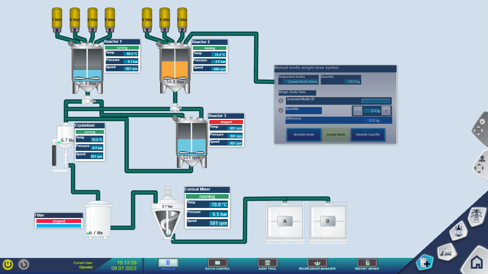

рис.1.13

#### Завдання 1.6: Ознайомлення з іншими процесами   

- Відкрийте наступні сторінки процесів та проаналізуйте їх зміст та спосіб відображення стану процесу
  - FOOD & BEVERAGE -> Machine Status
    - перевірте роботу кнопок навігації внизу екрану
  - Energy -> Storage Power Station
    - спробуйте покерувати вентилями
    - перевірте роботу кнопок навігації внизу екрану
  - Energy -> Substation
    - Через контекстне меню розподільчих вузлів та вимикачів (кружки та прямокутники) спробуйте подати живлення до споживачів з назвою `Direction 015`
  - Energy -> Wind Farm
    - використовуючи вікно навігації, збільшіть масштаб карти для перегляду стану вітряків
    - виділяйте лівою кнопкою миші вітряки для детального перегляду їх стану
    - використовуючи праву кнопку миші, рухайте карту в потрібному напрямку
  - Auotmotive -> Conveyor
    - використовуючи вікно навігації збільшіть масштаб для детального перегляду обладнання на конвеєрі 
    - вибирайте станції в station list
    - перевірте роботу кнопок навігації внизу екрану
  - Auotmotive -> Dashboard
  - Auotmotive -> Body Shop Cell
  
- Зробіть для звіту копії екранів з нотатками для захисту роботи

### 4. Ознайомлення з підсистемою тривожної сигналізації

#### Завдання 1.7. Робота з вікном тривог

- відкрийте сторінку FOOD & BEVERAGE -> Machine Status
- проаналізуйте зміст вінка Alarm Message List, зокрема зверніть увагу на колонки повідомлень тривог (рис.1.14):
  - Time Received - час виникнення тривоги
  - Time cleared - час зникнення тривоги
  - Time acknowledged - час підтвердження тривоги
  - Indentification - ідентифікація місця виникнення тривоги
  - Text - текст тривоги
  - User - користувач що підтвердив тривоги   

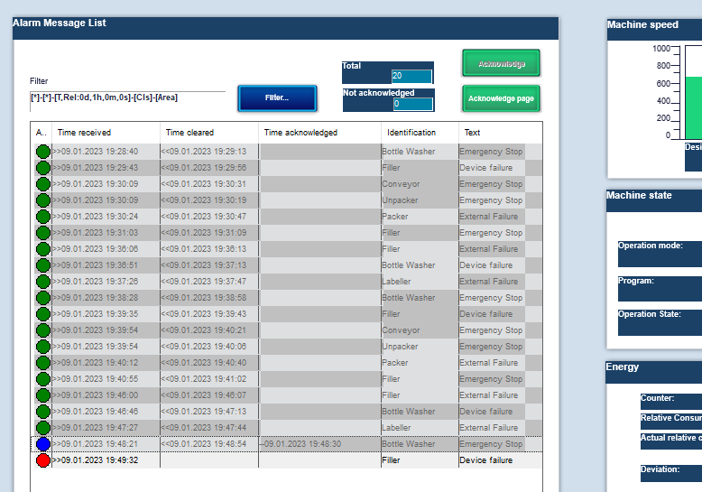

рис.1.14

- кольором кружечків показані стани тривог, занотуйте яким кольором показані ці стани
- дочекайтеся коли виникне нова тривога, зробіть подвійним кліком підтвердження тривоги (для цього попередньо необхідно залогінитися в zenon під оператором або адміністратором)
- відкрийте сторінку `Energy`  -> `Alarm List`
- проаналізуйте список тривог
- подивіться які числа у `Total` , `Number of Alarms` та `Not Acknowledged`
- зробіть копії екранів для звіту
- використовуючи кнопку `Acknowledge Page` зробіть підтвердження всіх тривог на сторінці
- знову подивіться які числа у `Total` , `Number of Alarms` та `Not Acknowledged`
- використовуючи кнопку `Acknowledge All` зробіть підтвердження всіх тривог на сторінці
- зробіть копії екранів для звіту

#### Завдання 1.8. Налаштування фільтрів активних тривог

- Натисніть кнопку Filter для віклику вікна фільтрування тривог (рис.1.15) 

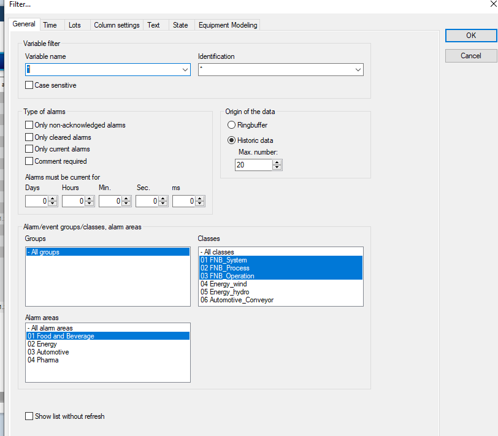

рис.1.15. 

- у списку `Alaram areas` виберіть `Energy` а у  `Classes` -  `Energy_wind` та натисніть `ok`
- у фільтрі виставте опцію `Only Current alarms`, подивіться що змінилося, зробіть копію екрану для звіту з нотатками 
- у фільтрі виставте опцію `Only non-acknowledged alarms`, подивіться що змінилося, зробіть копію екрану для звіту з нотатками 
- приберіть обидві опції з фільтра, щоб відображалися усі стани тривог
- у налаштуваннях фільтру перейдіть до вкладки `Colume settings` (налаштування колонок), та виставіть опцію `Time active` а в `Description` напишіть `Час активності` також приберіть усі опції крім показаних на рис.1.16.

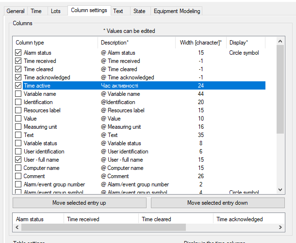

рис.1.16. 

- введіть текст типу `профіль Прізвище` та натисніть `Save` 

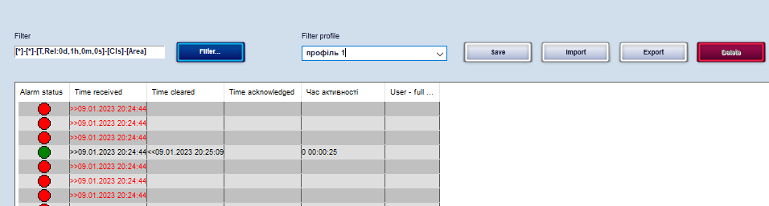

рис.1.17. 

- переключіться на іншу сторінку, потім знову поверніться на цю, після чого можна вибрати вказаний профіль в списку
- у налаштуваннях фільтру перейдіть до вкладки `Time` (часові налаштування), у `Filter` виставте відносний час (Rellative time period) а у `Settings` 1 хвилину (рис.1.18), натисніть `ok`   

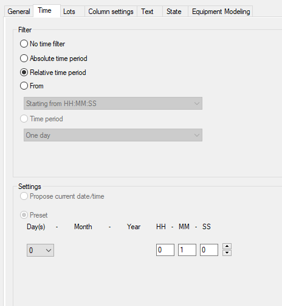

рис.1.18. 

- зробіть копії екрану результату

### 5. Ознайомлення з журналами подій

#### Завдання 1.9. Робота з журналом подій

- відкрийте сторінку `Paharma`  -> `Process`
- натисніть на кнопку `Audit Trail` у вікні навігацій - з'явиться вікно з журналом поідй 

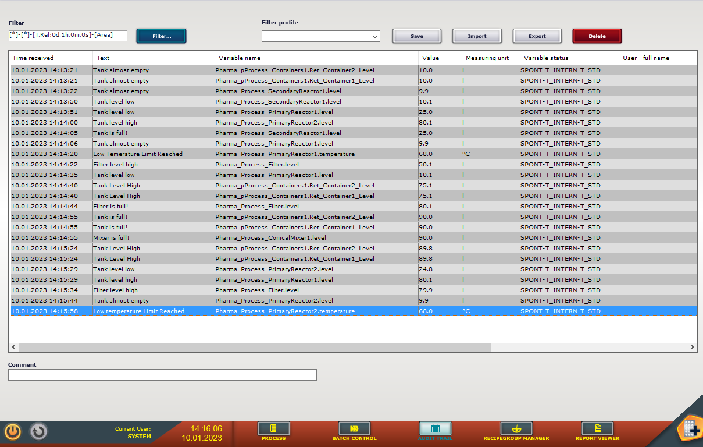

рис.1.19. 

- відкрийте фільтр і виберіть історичний режим (Historic Data) на 1000 записів
- Подивіться які поля виводяться в списку подій
- у фільтрі на вкладці `Time` виберіть діапазон `Absolute Time Period` і вкажіть в якості часу початку (From) - перший запуск SCADA zenon, а кінця (Until) - теперішній час 
- зробіть копію екрану для звіту 

### 6. Ознайомлення з трендами

#### Завдання 1.10. Перегляд трендів

- У розіділ FOOD & BEVERAGE відкрийте сторінку `Extended Trend` 
-  Ознайомтеся з наявною інформацією, зокрема (рис.1.20):
  - натисніть кнопку Stop потім Play, подивіться реакцію
  - у режимі Stop перекрутіть час відображення,  використовуючи кнопки назад/вперед (`<<` , `>>`)
  - ознайомтеся зі змістом осей
  - спробуйте роботу кнопок збільшення/зменшення (zoom)
  - активуйте лінію курсору кнопка `Cursor On` 
  - перемістіть лінію курсору кнопками вліво/вправо десь на середину діапазону і перегляньте в лівому нижньому списку плинні значення змінних (пірїв) в цій точці а також інші їх параметри 
  - у правому нижньому списку відображається легенда, подивіться яка інформація там доступна
  - спробуйте пересунути вертикальні (значення) та горизонтальну (час) осі 

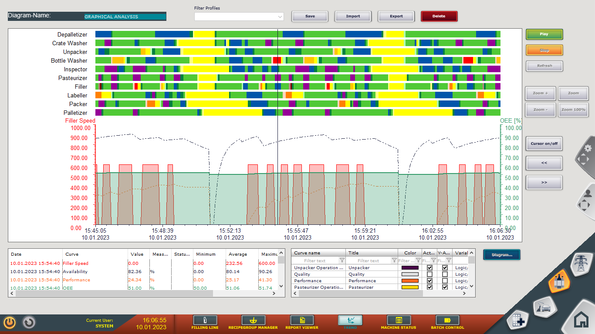

рис.1.20. 

- використовуючи список легенди зробіть наступне:
  - натисніть праву кнопку миші на колнках і в контекстному меню виберіть `Column Selection`; у вікні що з'явилося (рис.1.21) в список `Selected Columns` добавте поле  `Fill Color` і натисніть `Ок`   
  - змініть колір пера (`Color`) і заливки (`Fill Color`) для змінної `Filler Speed`
  - Вибираючи опції `Active` та `Y-Axis` керуйте видимістю пера та осі для нього
  - Змініть `Curve Name` для `Filler Speed` на `Швидкість заповнювача`

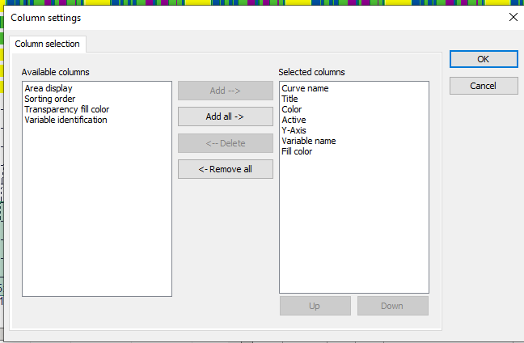

рис.1.21. 

#### Завдання 1.11. Налаштування осей трендів

- Наведіть мишку на вісь часу, щоб курсор змінив вигляд і на двосторонню стрілку і натисніть праву кнопку миші - відкриється вікно налаштування осі часу (рис.1.22. )
- На закладці `X-Axis` : 
  - виставте опцію `Show vertical grid lines`
  - приберіть опцію відображення років `Scale->YY`
- На закладці `Time` виставіть відбораження відносного часу (Relative Time Period)  1 годину і натисніть ок

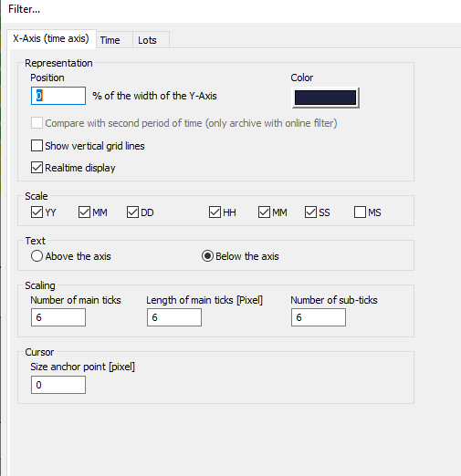

рис.1.22. 

- Наведіть мишку на ліву вісь значень, щоб курсор змінив вигляд і на двосторонню стрілку і натисніть праву кнопку миші - відкриється вікно налаштування лівої осі (рис.1.23. ) 
- В налаштуваннях осі виставте наступні характеристики, після чого натисніть `Ok`:
  - виставте опцію `Automatic Scaling`
  - виставте опцію `Show horizontal grid lines` 

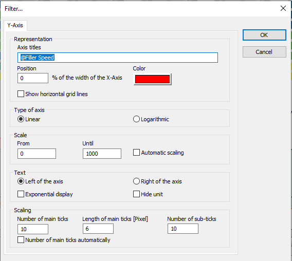

рис.1.23. 

- збережіть налаштування в профілі з якоюсь назвою аналогічно, як ви це робили для тривог 
- зробіть копію екрану для звіту

### 7. Ознайомлення зі звітами

#### Завдання 1.12. Перегляд звітів

- У розіділі FOOD & BEVERAGE відкрийте сторінку `Report Viewer` 
- Ознайомтеся зі змістом звітів, натискаючи на кнопки: (рис.1.24)
  - Alarm Report
  - OEE Report
  - Batch Report
  - Consumption Report

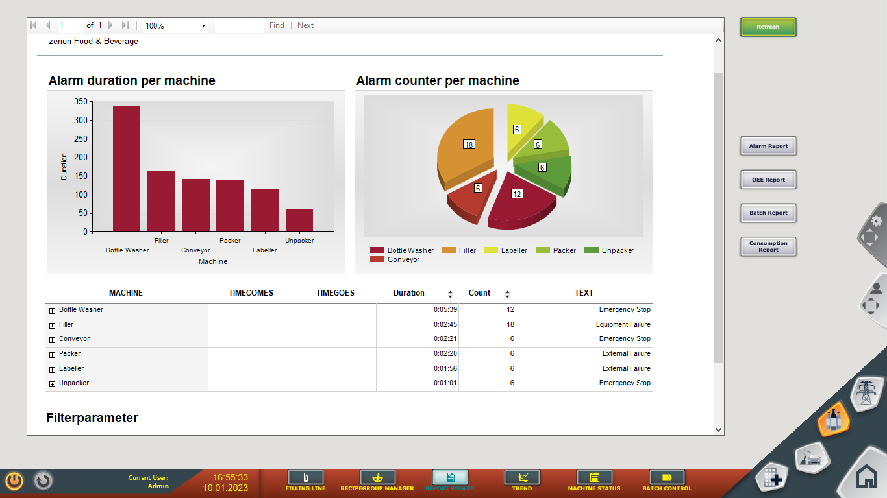

рис.1.24. 

- завершіть роботу середовища виконання

## Порядок прийому роботи 

Здобувач надає звіт у форматі документу Word, у якому наводяться усі копії екранів та примітки до них  Викладач може перевірити вибірково демонстрацію виконання пунктів лабораторної роботи. Нижче наведена методика перевірки (орієнтовно, вибірково):

1. Покажіть способи відображення дискретного, аналогового, текстового значення. 
2. Покажіть властивість тривоги та прокоментуйте поля.
3. Застосуйте фільтр по часу для тривог. 
4. Як зареєстровати користувача.
5. Покажіть як тривоги квітуються (підтверджуються).
6. Покажіть як налаштовуються осі часу для трендів.

## Питання до захисту 

1. Як організовано меню в проекті? Як організовані команди керування в меню на сторінках? 
2. Де і для чого в проекті Example використовується анімація миготіння?
3. Розкажіть яку інформацію Ви можете отримати зі сторінок процесів?
4. Які елементи відображення значення/стану використовуються в проекті?
5. Які інструменти для перегляду тривог(активних, журналів тривог та ін.) та керування їх станом задіяні в проекті?
6. Як дізнатися про перелік активних тривог в даний момент часу? Чи доступна ця інформація перед очима у оператора завжди у даному демопроекті?
7. Як повідомлення тривог розрізняються за станом?
8. Як дізнатися детальну інформацію про потрібну тривогу? Прокоментуйте, яка інформація доступна оператору?
9. Як ведуть себе повідомлення в списку активних тривог при зміні їх стану? 
10. Розкажіть навіщо потрібно підтвердження (квітирування) тривоги? Як це робиться в проекті? Як видно чи тривога була підтвердженою?
11. Де і як можна дізнатися коли тривога виникла, зникла, була підтвердженою?
12. Навіщо потрібні фільтри в переглядачах тривоги? За якими властивостями тривоги в проекті можна застосовувати фільтри?
13. Розкажіть про функції журналу подій.
14. Для чого призначені трендові переглядачі? Яку інформацію ви бачили в трендових переглядачах у zenon? 
15. Для чого потрібна легенда трендів? Яка інформація там доступна для відображення?
16. Розкажіть про призначення курсору на трендових переглядачах.
17. Назвіть елементи навігації та масштабування для трендів та розкажіть їх призначення.
18. Як і для чого використовуються профілі в SCADA zenon?
19. Поясніть відмінність середовища розроблення та середовища виконання SCADA/HMI. Яке саме середовище потрібне для роботи АРМу оператору на підприємстві?
20. Від чого залежить вартість середовища виконання SCADA/HMI?
21. Які типові функції надають програми SCADA/HMI?
