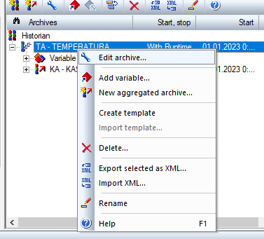

[На основну сторінку курсу](../../README.md)     [До списку лабораторних](../README.md)

# Лабораторна робота №6

**Тема. Тренди**

**Тривалість**: 4 акад. години (2 пари).

**Мета:** навчитися конфігурувати тренди та створювати екрани для них   

**Цілі.** 

1. Створити циклічний архів
2. Створити екран з часовим фільтром
3. Зробити каскадний архів
4. Налаштувати трендові екрани

**Лабораторна установка**

- Апаратне забезпечення: ПК. 

- Програмне забезпечення: SCADA zenon.

## Порядок виконання роботи 

### 1. Створення циклічного архіву

Система керування дозволяє здійснювати архівування в трьох режимах: циклічному  (раз в секунду, хвилину, годину…), по зміні параметру, по події  (тригерне). Усі зібрані дані можуть зберігатися у внутрішньому форматі  (arx), текстовому (csv), веб-форматі (xml) чи безпосередньо в SQL-базі  даних. Також, окремо виділяється пакетне (batch) архівування, яке представляє  собою спеціальний режим архівування, який використовується в харчовій та фармацевтичній промисловості при виробництві продукції серіями (партіями, порціями, batch). Базова версія ліцензії zenon дозволяє здійснювати циклічне архівування. Усі інші режими архівування, у тому числі і створення каскадних архівів, доступні лише при замовленні повноцінного модуля архівів. У демо режимі доступні усі варіанти.

Надалі необхідно створити архів, в який кожні 5 секунд будуть заноситись значення змінних температури та рівня.

#### Завдання 6.1: Конфігурування трендового архіву

Зробіть кофігурування трендового архіву:

- В дереві проекту зайдіть в розділ *Historian* і правою кнопкою миші виберіть пункт *New* *Archive…*

*Автоматично з’явиться майстер швидкого налаштування архіву:*

**

- Надалі усі налаштування необхідно буде зробити уручну, тому просто закрийте його кнопкою *Cance.*

Після цього з’явиться діалогове вікно конфігурування архіву, яке містить п’ять вкладок. Розглянемо кожну з них.

##### Вкладка *Properties*

- Задайте довільний ідентифікатор архіву та його назву – `TA`, `TEMPERATURA`
- В секції *Variable* *selection* правою кнопкою миші через *Add* *variable* додайте змінну `Танк[1].Рівень` і `Температура[1]`


##### Вкладка *Runtime*

На цій вкладці конфігурується запуск і зупинка  ведення архіву. 

- Залиште запуск архівування при старті Runtime, як  встановлено за замовчуванням.


##### Вкладка *Type* *of* *scan*

На третій вкладці визначається частота зчитування значень змінних і заносу їх до архіву.

- Виберіть циклічний режим сканування *Cyclic* *scanning*
- Параметр *Cycle* *time* встановіть в *5* *Sec*.


Таким чином, значення наших змінних будуть заноситись до архіву кожні 5 секунд.

Зверніть увагу, що мінімальна дискретизація інтервалу запису в  архів – 1 секунда. Для швидшого збереження даних, необхідно  використовувати технологію *RDA*, при якій дані буферизуються в контролері, а потім пакетами передаються в SCADA разом з відмітками часу. Механізм RDA не розглядається в цьому лабораторному курсі.

##### Вкладка *Save*

У цій вкладці визначається формат збережених файлів, їх  розмір та метод видалення.

- Встановіть збереження архіву у внутрішньому форматі *Internal database* з циклом *2* *Min* 

За таких налаштувань кожні дві хвилини система  буде утворювати окремий архівний файл *.arx, який містить по 24 записів  (кожні 5 секунд протягом 2-х хвилин). Архівні файли внутрішнього формату – це  зашифровані бінарні файли невеликої ємності, які ніякою програмою, за  винятком самого zenon, не можуть бути відкриті. Окрім перегляду через  екран архівів, ці дані також можна використовувати в інших модулях  системи керування, таких як Тренди та Звіти.

**

- Активуйте опцію *Do* *not* *evacuate* і встановіть час збереження файлів в 1 день

За таких налаштувань архівні файли не будуть  вилучатись, а будуть зберігатись один день. Після чого вони у вигляді кільцевого буферу будуть перезаписуватись (нові дані записуються на місце старих).

##### Вкладка *Options*

Містить додаткові налаштування архіву які не потрібно наразі змінювати.

- Закрийте діалогове вікно конфігурування архіву кнопкою *OK*

Зроблені налаштування архіву можна у будь-який момент змінити за допомогою піктограми *Edit archive* у вікні детального перегляду.



<iframe width="640" height="360" src="https://www.youtube.com/embed/Q3lHUAatcOM" title="YouTube video player" frameborder="0" allow="accelerometer; autoplay; clipboard-write; encrypted-media; gyroscope; picture-in-picture" allowfullscreen></iframe>

### 2. Екран перегляду архіву у вигляді таблиці

#### Завдання 6.2: Створення екрану перегляду трендового архіву у вигляді таблиці

Створіть екран перегляду трендового архіву у вигляді таблиці:

- В дереві проекту зайдіть в розділ *Screens* і на базі фрейму `Головний` cтворіть новий екран `Архів`
- В якості спеціального типу виберіть *Archive* *revision*
- Через головне меню *Control* *elements* розмістіть на екрані усі необхідні елементи керування та відображення

<iframe width="640" height="360" src="https://www.youtube.com/embed/7QUkAq9jG7s" title="YouTube video player" frameborder="0" allow="accelerometer; autoplay; clipboard-write; encrypted-media; gyroscope; picture-in-picture" allowfullscreen></iframe>

#### Завдання 6.3: Створення функції виклику перегляду 

Створіть функцію виклику перегляду трендового архіву у вигляді таблиці:

- Для переходу на екран перегляду архіву створіть функцію *Screen* *switch* та прив’яжіть її до кнопки `Архів`, яку, як зазвичай, розмістіть на панелі навігації. При створенні функції перемикання з’явиться діалогове вікно конфігурування, яке має набір опцій налаштування.


Тут можна визначити три режими сортування даних: в часовій послідовності потрапляння до архіву, згруповані по змінним, та  взагалі без сортування. Окремої уваги заслуговує кнопка *Filter…*, яка містить ряд налаштувань представлення архівних даних. Тут можна  виконати фільтрування по архівним змінним, які ми бажаємо бачити при  переході на екран та діапазон часу. 

- Залишіть усі значення, як встановлено за замовчуванням. Завершіть конфігурування функції натиснувши кнопку *OK* і перейменуйте її в `Перехід на екран Архів`. 

<iframe width="640" height="360" src="https://www.youtube.com/embed/htM41Nq0N_E" title="YouTube video player" frameborder="0" allow="accelerometer; autoplay; clipboard-write; encrypted-media; gyroscope; picture-in-picture" allowfullscreen></iframe>

#### Завдання 6.4: Створення кнопки виклику функції

Створіть кнопку виклику функції, запустіть на виконання систему і подивіться екрани в роботі:

- Відкрийте екран `Навігація` і створіть нову кнопку з ім’ям `Архів`
- У властивостях *Variable\function -> Function* виберіть створену функцію `Перехід на екран Архів`


Через кнопку `Filter…` оператор має можливість в режимі Runtime виконати певні налаштування представлення списку даних. 

- Також, система керування дозволяє здійснювати ручну модифікацію значень змінних авхіву. Двічі клікніть на значенні змінної яке Ви хочете відкоригувати


Помінявши значення, статус запису зміниться на  `MAN_VAL` і заголовок списку прийме червоний колір. Після збереження  зроблених правок заголовок поверне свій початковий вигляд.

Зверніть увагу, що при кожному запуску проекту встановлені  налаштування ширини стовбців будуть збиватись. Щоб цього не було налаштування параметрів записують в системному файлі програми *zenon**.**ini*  Цей файл знаходиться в системній директорії `C:\ProgramData\COPA-DATA\System` (для Windows). Будьте обережними зі змінами в ньому, оскільки невірні дії можуть вивести систему з ладу. У цій лабораторній роботі ці зміни робити не потрібно. Приклад налаштування:

```ini
[ARCHEDIT]
ARCHEDITFONT=-13,0,0,0,400,0,0,0,0,3,2,1,49, Courier New
DATUMBREITE=25
EINHEITBREITE=10
STATUSBREITE=15
VARIABLEBREITE=10
WERTBREITE=10
ZUSTANDBREITE=10
```

Також варто зауважити, що архівні  дані представляються суцільним списком, який не дуже зручний для  аналізу. Для представлення виміряної інформації у вигляді повноцінного  табличного звіту з довільним розбиттям даних по стовбцям чи колонкам,  необхідно використовувати модуль Reporting, який не розглядається в цьому лабораторному курсі.

<iframe width="640" height="360" src="https://www.youtube.com/embed/qlsPni9-99w" title="YouTube video player" frameborder="0" allow="accelerometer; autoplay; clipboard-write; encrypted-media; gyroscope; picture-in-picture" allowfullscreen></iframe>

### 3. Екран з часовим фільтром

#### Завдання 6.5: Створення екрану з часовим фільтром

Для поліпшення взаємодії оператора з екраном перегляду архіву існує  спеціальний тип екрану – Time filter, за допомогою якого можна в  зручному вигляді здійснювати фільтрування списку даних по часу. Цей  екран фільтру повинен базуватись на своєму індивідуальному фреймі.

- Створіть новий фрейм з назвою `popupfilter`, який займе десь третю частину екрану.
- Створіть новий екран, який буде базуватися на фреймі `popupfilter` типу   `Time filter`.
- Розмістіть спеціальні елементи за замовченням.


- Створіть функцію перемикання на даний екран, в параметрах функції виставте опцію  `Calling screen`, яка буде вказувати що фільтр буде застосовуватися для того екрану з якого було викликано екран фільтру. 


- На екрані  `Архів` створіть кнопку з написом `Простий фільтр` і вкажіть запуск функції відкриття новоствореного екрану фільтру
- Перевірте роботу кнопки та фільтру в середовищі виконання 

<iframe width="640" height="360" src="https://www.youtube.com/embed/Eb8dL6oIduI" title="YouTube video player" frameborder="0" allow="accelerometer; autoplay; clipboard-write; encrypted-media; gyroscope; picture-in-picture" allowfullscreen></iframe>

### 4. Аріхівні файли та експорт архіву

**Архівні файли** 

Система утворює два типи файлів. Один файл –  заголовний `TA.ARX`, який містить налаштування архіву. Усі інші – це файли з архівними даними, наприклад, `TA140317153800.ARX`. В назві файлу з архівними даними зашифровано ідентифікатор архіву, дату та час створення файлу (по Гринвічу). Так наприклад наступний створений системою файл буде мати ім’я `TA140317154000.ARX`. Ці файли зберігаються папці проекту, яка містить  його ім’я та назву робочої станції (наприклад, `C:\Users\Golinko\PROJECT1\N89A167\PROJECT1`). Точну директорію можна  знайти через налаштування властивостей проекту *General* *->* *Name**/**Folder* *->* *Runtime folder.*  


**Експорт архіву**

Якщо при конфігуруванні архіву, на вкладці *Save* вибрати опцію збереження даних в форматі CSV, то інформація буде  зберігатись в файли в папку ExportArx, місце розташування якої  визначається у властивостях проекту *General* *->* *File storage.* По замовчуванню це папка проекту (`C:\Users\Golinko\ PROJECT1\ExportArx`). Файли CSV-формату - це текстові файли з роздільниками, придатні до використання і аналізу в MS Excel. 

#### Завдання 6.6: Експорт архіву.

- В менеджері проекту зійдіть в розділ *Function* і створіть нову функцію *Export* *archives*, яка знаходиться в підрозділі *Historian*

Далі з’явиться діалог налаштування функції експорту з набором вкладок.

- На вкладці *General* активуйте опції експорту в формат *CSV* з заносом даних змінної і часу, автоматичної генерації ім’я файлу та відображення цього діалогу в Runtime.
- На вкладці *Archive* виберіть архів `ТА-TEMPERATURA`
- На вкладці *Time* виберіть час, за який повинні експортуватись дані, наприклад, 1 годину


- Закінчіть конфігурування кнопкою *OK* і перейменуйте створену функцію в `Експорт архіву`

Архівні файли будуть експортуватись в файли в папку `ExportArx`, місце розташування якої визначається у властивостях проекту *General* *->* *File storage.* При бажанні тут можна визначити будь-яку директорію.

Тепер необхідно створити на екрані перегляду архіву відповідну кнопку експорту:

- Відкрийте екран `Архів` і справа над кнопкою друку створіть нову кнопку з назвою `Експорт`
- У властивостях створеної кнопки *Variable function* *->* *Function* прив’яжіть функцію `Експорт архіву`

- Запустіть Runtime і виконайте експорт архіву. Оскільки при конфігуруванні функції експорту було активовано опцію  відображення діалогу налаштування, то оператор має можливість в онлайн  режимі вибрати формат збереження даних та параметри, які повинні  заноситись до архіву. Поетапно виконайте експорт архіву в усі доступні формати: `dBase`, `CSV` та `XML`. 

<iframe width="640" height="360" src="https://www.youtube.com/embed/Y6uRYWWtplQ" title="YouTube video player" frameborder="0" allow="accelerometer; autoplay; clipboard-write; encrypted-media; gyroscope; picture-in-picture" allowfullscreen></iframe>

### 5. Каскадний архів

У деяких випадках необхідно здійснювати архівацію не прямих значень  змінних, а похідних даних, наприклад сумарного значення за певний  період, середнього, мінімального чи максимального. Для цієї задачі в  zenon існує поняття каскадного архіву.

У даному пункті необхідно на базі циклічного архіву організувати каскадний архів мінімальних значень температури та рівня.

#### Завдання 6.7: Налаштування каскадного архіву

- В дереві проекту зайдіть в розділ *Historian* і з контекстного меню архіву `ТА-TEMPERATURA` виберіть пункт *New* *Aggregated archive…*

- Автоматично з’явиться майстер швидкого налаштування архіву. Усі налаштування будуть робитися вручну, тому просто закрийте його  кнопкою *Cancel.*

У вікні конфігурування архіву зробіть наступні дії.

##### Вкладка *Properties*

**

- Задайте довільний ідентифікатор архіву та його назву – `КA`, `KASKAD`
- В секції *Variable* *selection* правою кнопкою миші через *Add* *variable* для розділу *Minimum* додайте змінну `Танк[1].Рівень` і `Температура[1]`
- У вкладці `Save` виставте щоб глибина файлу була 1 година


Налаштування на інших вкладках залиште без змін:  запис по зміні, без евакуації.

- Закрийте діалог налаштування кнопкою *OK*.

На цьому конфігурування каскадного архіву завершене. Тепер коли основний архів буде зберігати файл архіву (кожні 2 хвилини) з нього буде вийматися інформація про мінімальні значення змінних темепратури і рівня і фіксуватися в каскадний архів, кожен файл якого буде з глибиною одна година, тобто 30 записів на кожну зміну (60 хв/2 хв) .  

- Перейдіть в Runtime.
- Змініть значення змінних, які пишуться в архів. 
- Дочекайтеся 2 хв після початку. Відкрийте вікно перегляду архіву. Кнопкою `Open…` відкрийте архів `KA - KASKAD`.


Система підгрузить лише мінімальні значення, які  мали змінні протягом кожних 2-х хвилин. До імені змінної допишеться  закінчення `[МI]` – мінімальне значення. При інших типах каскадних архівів допишеться `[МА]` – максимум, `[МW]` – середнє значення, `[SU]` – сума. Спробуйте самостійно опрацювати ці варіанти. 

<iframe width="640" height="360" src="https://www.youtube.com/embed/vsl9GUZ8sqs" title="YouTube video player" frameborder="0" allow="accelerometer; autoplay; clipboard-write; encrypted-media; gyroscope; picture-in-picture" allowfullscreen></iframe>

### 6. Налаштування трендових екранів

З метою аналізу і зручного візуального сприйняття, виміряну інформацію  представляють у вигляді графіків – трендів. На відміну від вже  розглянутого нами трендового елементу, який дає можливість подивитися збережені дані у вигляді таблиці, zenon дозволяє створювати повноцінні трендові екрани з великою кількістю налаштувань. Трендові криві можуть будуватись на  основі як онлайн так і архівних даних. Слід відмітити що базова версія ліцензії *zenon* містить стартову редакцію модуля трендів. Для отримання повної функціональності, необхідно придбати відповідну ліцензію. У демо-версії функціональність перегляду у вигляді трендів доступна без обмежень. 

#### Завдання 6.8: Створення екрану трендів

Створіть екран відображення графіків архівних змінних – температури та рівня.

- В дереві проекту зайдіть в розділ *Screens* і на базі фрейму `Головний` cтворіть новий екран `Тренди`
- В якості спеціального типу виберіть *Extended* *Trend* і задайте довільний колір фону
- Через головне меню *Control* *elements,* використовуючи кнопочні шаблони, розмістіть на екрані усі необхідні елементи керування та відображення

<iframe width="640" height="360" src="https://www.youtube.com/embed/h0bNjYKIoiU" title="YouTube video player" frameborder="0" allow="accelerometer; autoplay; clipboard-write; encrypted-media; gyroscope; picture-in-picture" allowfullscreen></iframe>

#### Завдання 6.9: Створення функції виклику екрану

При створенні екрану трендів найважливіше значення має конфігурування функції перемикання.

- В дереві проекту зайдіть в розділ *Functions* і правою кнопкою миші створіть нову функцію *Screen switch* і вкажіть екран `Тренди`

Автоматично з’явиться діалог конфігурування  функції, через який здійснюється вибір кривих, що будуть відображуватись та їх налаштування.

- Для поля *Origin* *of* *the* *data* виберіть *Archive* *data*
- *Refresh rate* встановіть в *2* *sec*
- Активуйте опцію *YT-display*
- Натисніть кнопку *Add curve …* і додайте з архіву змінну `Танк[1].Рівень` та `Температура[1]`
- Для кожної кривої проконтролюйте щоб були активовані бокси *Show* *curve* та *Show* *y**-**axis* *for* *curves*

**

Налаштуйте представлення часової вісі діаграми.

- Натисніть кнопку *Time axis and time filter*. З’явиться додатковий діалог конфігурування з вкладками:


- На вкладці *x**-**axis* активуйте *Show* *vertical* *grid* *lines* і залиште підписи для годин хвилин та секунд
- На вкладці *Time* залиште *Relative* *time* *period* і встановіть період представлення шкали в 10 хвилин
- Закрийте вікно кнопкою *OK*

Тепер необхідно сконфігурувати окремо кожну криву:

- В полі *Curves* двічі клікніть на кривій `Танк[1].Рівень`

З’явиться додатковий діалог конфігурування з двома вкладками налаштування параметрів кривої та вісі ординат.

- На вкладці *Curve* *parameters* виберіть суцільну лінію представлення та активуйте інтерполяцію
- Колір кривої встановіть синій


- На вкладці *y* *axis* задайте підпис вісі 'L',
- Колір вісі встановіть в синій
- Активуйте опцію *Show* *horizontal* *grid* *lines* 
- Діапазон шкали залишіть як виставила система (0 – 2.55)
- Підписи шкали повинні відображатись з лівого боку
- Закрийте вікно кнопкою *OK*

**

Повторіть зроблені операції для другої кривої:

- В полі *Curves* двічі клікніть на кривій 'Температура[1]'
- На вкладці *Curve* *parameters* виберіть суцільну лінію представлення, активуйте інтерполяцію та зафарбовування площини
- Встановіть колір кривої в червоний та рожеве зафарбовування площини під кривою


- На вкладці *y* *axis* задайте підпис вісі 'Т',
- Позицію зміщення вісі виставте в 100 %
- Колір вісі встановіть в червоний
- Активуйте опцію *Show* *horizontal* *grid* *lines* 
- Діапазон шкали залишіть як виставила система (0 – 150)
- Підписи шкали повинні відображатись з правого боку
- Закрийте вікно кнопкою *OK*


Перейменуйте створену функцію в `Перехід на екран Тренди`

<iframe width="640" height="360" src="https://www.youtube.com/embed/uYUXsNBeWbI" title="YouTube video player" frameborder="0" allow="accelerometer; autoplay; clipboard-write; encrypted-media; gyroscope; picture-in-picture" allowfullscreen></iframe>

### 7. Трендові екрани в режимі виконання

#### Завдання 6.10: Створення кнопки виклику трендового екрану 

Створіть кнопку виклику трендового екрану і запустіть систему на виконання:

- На екрані `Навігація` створіть нову кнопку з ім’ям `Тренди` і прив’яжіть відповідну функцію

- Запустіть проект і перейдіть на екран трендів. У  Вас повинен з’явитись екран з відображенням кривих рівня і температури з заданим часом поновлення діаграми – 2 секунди. Поверніться на основний  екран процесу і просимулюйте хаотичну зміну значення трендових змінних.

- Поверніться на екран трендів і перевірте  функціонал наявних на ньому кнопок: сканування значень кривих,  масштабування, активації (кривих та вісей), збереження індивідуальних  конфігурацій в профілі.

Також, оператор має можливість в режимі Runtime через кнопку 'Diagram' здійснювати додаткові налаштування відображення кривих.


- За допомогою кнопок переміщення по  діаграмі зробіть прокрутку кривих в часі та їх аналіз.

<iframe width="640" height="360" src="https://www.youtube.com/embed/4cesrPWlOrc" title="YouTube video player" frameborder="0" allow="accelerometer; autoplay; clipboard-write; encrypted-media; gyroscope; picture-in-picture" allowfullscreen></iframe>

#### Завдання 6.11: Перевірка екрану часового фільтру 

- На сторінці перегляду трендів добавте кнопку виклику екрану фільтру, що Ви створювали для перегляду у табличному вигляді.
- Перевірте роботу фільтра. 

<iframe width="640" height="360" src="https://www.youtube.com/embed/OlKXVXGuDtU" title="YouTube video player" frameborder="0" allow="accelerometer; autoplay; clipboard-write; encrypted-media; gyroscope; picture-in-picture" allowfullscreen></iframe>

## Порядок прийому роботи 

Здобувач надає звіт у форматі документу Word, у якому наводяться усі копії екранів та примітки до них  Викладач може перевірити вибірково демонстрацію виконання пунктів лабораторної роботи. 

## Питання до захисту 

1. Розкажіть про необхідність та функції підсистеми трендів. 
2. Розкажіть як налаштовується в zenon трендовий архів. 
3. Як в zenon задається періодичність запису та глибина історії.
4. Яке призначення експорту архівних даних? Яку функціональність в цьому надає zenon?
5. Які можливості є у екранів zenon для перегляду архівів у табличному вигляді?
6. Розкажть про призначення каскадного архіву в zenon. Як він налаштовується? 
7. Які функції надає екран перегляду архівів у вигляді трендів? Що налаштовується на цьому екрані і які спеціальні функції використовуються в лабораторній роботі.
8. Розкажіть про функціональність трендових екранів в режимі виконання. 

