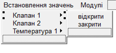
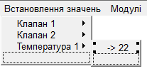
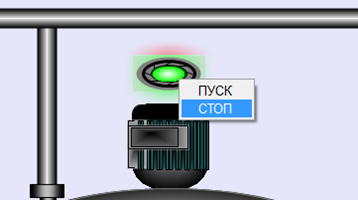

[На основну сторінку курсу](../../README.md)     [До списку лабораторних](../README.md)

# Лабораторна робота №8

**Тема. Розроблення головних та контекстних меню **

**Тривалість**: 2 акад. години (1 пара).

**Мета:** навчитися створювати головні та контекстні меню   

**Цілі.** 

1. Створити та налаштувати головне меню
2. Створити та налаштувати контекстне меню

**Лабораторна установка**

- Апаратне забезпечення: ПК. 

- Програмне забезпечення: SCADA zenon.

## Порядок виконання роботи 

### 1. Головне меню

У випадку, якщо проект має велику кількість елементів керування – кнопок, то для оптимізації користувацького інтерфейсу логічно створити меню.  zenon дозволяє створювати меню аналогічні до тих, які є в програмах  Windows: головне меню, яке знаходиться в верхній частині екрану та  контекстне меню, яке викликається при натисненні правою кнопки миші на  елементі інтерфейсу.

**Головне меню**

#### Завдання 8.1: Створення головного меню 

Створіть головне меню з дублюванням функцій кнопок на панелі навігації.

Давайте створимо головне меню, яке буде дублювати кнопки, які ми маємо на екрані навігації.

- В дереві проекту активуйте пункт *Menus* і через праву кнопку мишки виберіть пункт *New* *main* *menu*

*У вікні детального перегляду з’явиться новий пункт – \*Main menu 0.\* Після його вибору у вікні конструктора відобразиться поле конфігурування пунктів та структури нашого головного меню.*

**

Поступово сформуйте розділи та пункти головного меню, які мають такі елементи, як показано на малюнку нижче.

Також зробіть, щоб кожен пункт розділу 'Встановлення значень', мав свої власні підпункти.

- Виділіть пункт 'Клапан 1' і у властивостях *Representation* */* *Type* активуйте бокс *Submenu*

В конструкторі меню автоматично з’явиться новий підпункт.

- Створіть нові підпункти, як показано на малюнку нижче
- Повторіть описані вище дії для пункту 'Клапан 2' та 'Температура 1'

  

<iframe width="640" height="360" src="https://www.youtube.com/embed/cyq4X9PUHo0" title="YouTube video player" frameborder="0" allow="accelerometer; autoplay; clipboard-write; encrypted-media; gyroscope; picture-in-picture" allowfullscreen></iframe>

### 2. Означення дій

#### Завдання 8.2: Визначення дій для пунктів меню

Визначте дії для пунктів меню.

Для кожного пункту меню можна визначити три дії: виконання функції,  встановлення певного значення змінній та виклик файлу допомоги.

- Виділіть пункт 'Процес' розділу меню 'Головний екран'
- У вікні властивостей зайдіть в *Representation* */* *Type* *->* *Action* *type**:* і зі спадного меню виберіть *Function*
- В розділі властивостей *Function**/* *macro* прив’яжіть функцію 'Перехід на екран Процес'

Аналогічну операцію виконайте для пунктів розділу  меню 'Системні функції' та 'Модулі'. Для пунктів розділу 'Встановлення  значень' визначіть дію встановлення значень змінним.

- Виділіть пункт 'Клапан 1' -> 'відкрити' розділу меню 'Встановлення значень'
- У вікні властивостей зайдіть в *Representation* */* *Type* *->* *Action* *type**:* і зі спадного меню виберіть *Write* *set* *value*
- В розділі властивостей *Write* *set* *value* *->* *Variable**:* виберіть змінну 'Танк[1].Клапан[1]', а також для опції *Set* *value**/**Change* *by**:* встановіть значення '1'
- Для пункту 'Клапан 1' -> 'закрити'  повторіть описані вище дії, але значення встановіть в '0'

Аналогічні операції виконайте для пункту 'Клапан 2' та 'Температура 1'. Для останнього встановіть значення  в '22'.

Таким чином, через головне меню, окрім перемикання між екранами ми також зможемо відкривати\закривати клапани та  встановлювати конкретне значення для першої температури.

Також необхідно прив’язати відповідні рівні доступу до пунктів меню. Зробіть це на власний розсуд через властивість *Authorization* *->* *Authorization* *level**:.*

На цьому конфігурування пунктів меню завершене.

<iframe width="640" height="360" src="https://www.youtube.com/embed/AFQUHDNUq8k" title="YouTube video player" frameborder="0" allow="accelerometer; autoplay; clipboard-write; encrypted-media; gyroscope; picture-in-picture" allowfullscreen></iframe>

### 3. Активація головного меню

#### Завдання 8.3: Активація головного меню

Активуйте головне меню.

Лише створити меню не достатньо. Необхідно його активувати.

- У вікні властивостей проекту зайдіть в *розділ* *Graphical* *design* *->* *Runtime* *general* і активуйте бокс *Main* *menus* *active*
- Створіть нову функцію *Screens -> Show menu*
- В діалоговому вікні налаштувань функції вкажіть створене нами меню.

- Задайте цій функції ім’я 'Відображення головного меню

Тепер даний скрипт містить п’ять функцій, які будуть виконуватись при запуску проекту, у тому числі і запуск головного меню.

*Головне меню з’являється у фіксованому місці – верхнє поле шириною 20 pips. Як пам’ятаєте, ми з самого початку при конфігуруванні  розташування фреймів екранів залишили зверху вільне місце. Якраз це  місце в Runtime буде займати головне меню. Якщо Ви так не зробите, то  відкритий екран просто закриє собою створене меню.*

**

Запустіть Runtime і перевірте роботу меню.

<iframe width="640" height="360" src="https://www.youtube.com/embed/grDibtiEhcQ" title="YouTube video player" frameborder="0" allow="accelerometer; autoplay; clipboard-write; encrypted-media; gyroscope; picture-in-picture" allowfullscreen></iframe>

### 4. Контекстне меню

#### Завдання 8.4: Створення контекстного меню

Створіть та перевірте роботу контекстного меню.

Давайте зробимо так, щоб другий танк запускався кнопкою лише через контекстне меню при натисненні на ній правою кнопкою мишки.

- В дереві проекту активуйте пункт *Menus* і через праву кнопку мишки виберіть пункт *New* *context* *menu*

*У вікні детального перегляду з’явиться новий пункт – \*Context menu 0.\* Після його вибору у вікні конструктора відобразиться поле конфігурування пунктів та структури нашого контекстного меню.*

- Створіть пункти 'ПУСК' та 'СТОП'

- Виділіть пункт 'ПУСК' і у вікні властивостей зайдіть в розділ *Representation* */* *Type* *->* *Action* *type**:*
- Зі спадного меню виберіть тип дії *Write* *set* *value*
- В розділі властивостей *Write* *set* *value* *->* *Variable**:* виберіть змінну 'Танк[2].Пуск\Стоп', а також для опції *Set* *value**/**Change* *by**:* встановіть значення '1'
- Для пункту 'СТОП' повторіть описані вище дії, але значення встановіть в '0'
- Відкрийте екран 'Процес' і виділіть комбоелемент пуску другого танку зі змінною 'Танк[2].Пуск\Стоп'
- В меню властивостей зайдіть в розділ *Runtime* *->* *Context* *menu**:* і зі спадного меню виберіть створене нами контекстне меню 'Context menu 0'

Незабудьте деактивувати в цьому елементі можливість керування звичайним методом – по натисненню лівої кнопки миші.

- В меню властивостей зайдіть в розділ *Write* *set* *value* *->* *Binary* *value* і зніміть галочку з боксу *Switch*.

В zenon є функціонал так званої інтерактивної  допомоги, коли при наведенні на елемент керування мишки, оператору  з’являється підказка. До цього часу ми цю можливість не використовували. Давайте розглянемо її.

- Повторно виділіть комбоелемент пуску другого танку і в меню властивостей зайдіть в розділ *Runtime* *->* *Tooltip**:*
- В пустому полі введіть текст підказки: 'Керування через праву кнопку миші'

Запустіть Runtime і перевірте як працює контекстне меню та інтерактивна підказка.

 

Докладніше про створення меню можна познайомитись в мануалі Menus.

<iframe width="640" height="360" src="https://www.youtube.com/embed/i1mF3_J93S4" title="YouTube video player" frameborder="0" allow="accelerometer; autoplay; clipboard-write; encrypted-media; gyroscope; picture-in-picture" allowfullscreen></iframe>

## Порядок прийому роботи 

Здобувач надає звіт у форматі документу Word, у якому наводяться усі копії екранів та примітки до них  Викладач може перевірити вибірково демонстрацію виконання пунктів лабораторної роботи. 

## Питання до захисту 

1. Як організовано меню в проекті? Як організовані команди керування в меню на сторінках? 
2. Де і для чого
