[На основну сторінку курсу](../../README.md)     [До списку лабораторних](../README.md)

# Лабораторна робота №9

**Тема. Переназначення, математичний, системний та імітаційний драйвер**

**Тривалість**: 2 акад. години (1 пара).

**Мета:** навчитися працювати з переназначеннями та різними системними драйверами   

**Цілі.** 

1. Зробити деякі переназначення
2. Використати математичний драйвер
3. Використати системний драйвер
4. Використати імітаційний драйвер

**Лабораторна установка**

- Апаратне забезпечення: ПК. 

- Програмне забезпечення: SCADA zenon.

## Порядок виконання роботи 

### 1. Переназначення

Переназначення (Allocation) – це стандартний функціонал системи, який дозволяє передавати поточне значення однієї змінної до іншої, будь то драйверна змінна чи внутрішня.

При створенні Переназначення визначають поняття  вихідної змінної, яка являється джерелом значення, та кінцевої змінної,  яка приймає відповідне значення.

#### Завдання 9.1: Створення переназначення

Створіть Переназначення для змінної "Вологість" яка буде передавати своє значення змінній 'Температура[3]'

- В менеджері проекту активуйте пункт *Variables* *->* *Allocations* і через праву кнопку мишки виберіть пункт *New* *allocation*
- У вікні властивостей створеного переназначеннядля поля *Source variable:* виберіть початкову змінну 'Вологість', і для поля *Target variable:* виберіть кінцеву змінну 'Температура[3]'

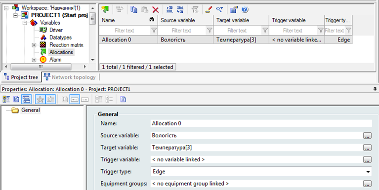

Більше жодних налаштувань робити не потрібно.

*При потребі, пере розподіленням можна керувати в онлайн режимі, використовуючи тригерну змінну. Коли ця змінна має  значення '1' – переназначенняактивне, коли '0' – неактивне.*

Запустіть проект і перевірте роботу  переназначення. Зверніть увагу на те, що змінна температури керується  індивідуально, а при зміні значення вологості, воно автоматично  передається до температурної змінної, тобто спрацьовує переназначення.

Докладніше про Переназначення можна прочитати в мануалі Allocations.

<iframe width="640" height="360" src="https://www.youtube.com/embed/zS7zSxceyKE" title="YouTube video player" frameborder="0" allow="accelerometer; autoplay; clipboard-write; encrypted-media; gyroscope; picture-in-picture" allowfullscreen></iframe>

### 2. Математичний драйвер

zenon дозволяє виконати будь-яку математичну обробку виміряного значення.  Наприклад, провести арифметичні дії з даними, обрахувати середнє чи  мінімальне значення за певний проміжок часу, напрацювання машино-годин,  виконати порівняння чи логічну операцію. Для цього існує математичний  драйвер, який вбудовано в систему.

За замовчуванням цей драйвер вже створено в проекті системою. Нам залишається лише використати його.

#### Завдання 9.2: Створення змінної для сумарного значення усіх температур

Створіть змінну для сумарного значення усіх температур

Для нашого проекту ми створимо змінну, яка буде представляти собою сумарне значення усіх температур.

- Створіть нову змінну 'Сума' і в якості драйвера зі  спадного меню виберіть математичний драйвер - MATHDR32 та об’єктний тип - Formula

*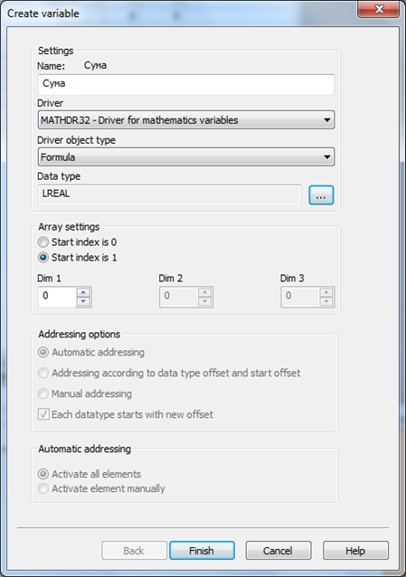*

- Зайдіть у властивості створеної змінної *Value* *calculation* *->* *Formula*

Автоматично з’явиться діалогове вікно запису формули:

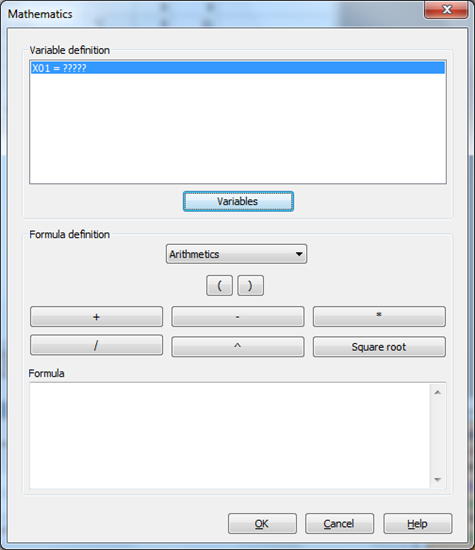

- Натисніть на кнопку *Variables*  та додайте усі температурні змінні

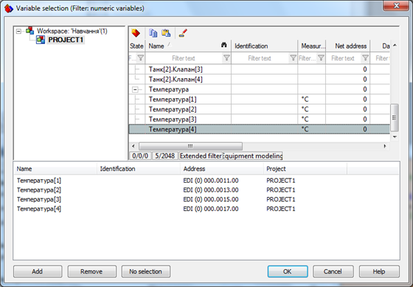

- Натисніть на кнопку *OK* і перейдіть безпосередньо до написання формули

Додаючи покроково змінні одна до одної, повинна сформуватись наступна формула:

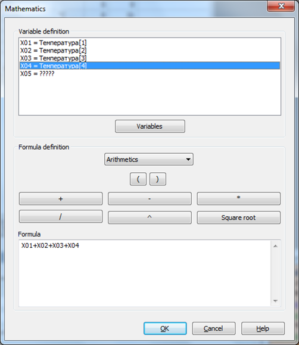

Після натиснення кнопки *OK* у вікні властивостей змінної 'Сума' з’явиться запис даної формули:

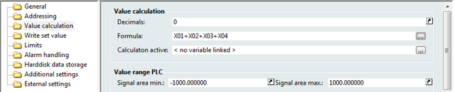

- На екрані 'Процес' в верхній його частині створіть  елемент відображення цифрового значення і прив’яжіть до нього створену  нами математичну змінну

Запустіть  проект і просимулюйте зміну значень температури. При цьому зверніть  увагу на те, як змінюється значення математичної змінної. Простим  додаванням значень переконайтесь, що Ви все зробили вірно.

### 3. Системний драйвер

Для відображення в проекті будь-якої системної інформації в zenon  інтегровано спеціальний системний драйвер. За його допомогою можна  наприклад, відобразити інформацію стосовно вільного місця на жорсткому  диску ПК, шлях до проектних директорій, мережевий стан клієнтських  станцій, поточного авторизованого користувача та багато інших корисних  даних.

#### Завдання 9.3: Створення системної змінної 

Створіть системну змінну для відображення об'єму вільного місця на диску.

При розгляді теми авторизації ви вже мали досвід по створенню  системної змінної. Тепер необхідно створити змінну, яка буде відображати  об’єм вільного місця на жорсткому диску.

- Створіть нову змінну і в якості драйвера зі спадного меню виберіть системний драйвер – SYSDRV

На наступному кроці з’явиться діалогове вікно з повним набором доступних користувачу системних змінних

- Зі спадного меню *Topic* виберіть розділ *HW* *Resources* і кнопкою *Add* додайте змінну *Free disk space – Database [KB]*

*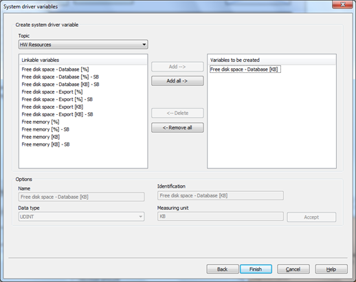*

- Натиснувши кнопку *Finish* закінчіть створення змінної

- Розмістіть елемент цифрового  покажчика в верхньому правому куті екрану процесу і прив’язати до нього  створену змінну.

Фрагмент екрану проекту тепер має такий вигляд:

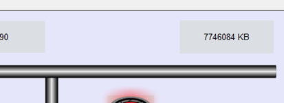

### 4. Імітаційний драйвер

Реалізація імітації (імітації) зміни значень змінних в zenon може відбуватись  трьома способами: шляхом переведення драйверу в стан  Simulation-counting, шляхом написання імітації на мовах IEC в zenon  Logic та за допомогою імітаційного драйверу.

Імітаційна змінна залежно від обраного режиму може збільшувати чи  зменшувати своє значення з чітко заданим кроком. Крок, режим, та межі –  це також імітаційні змінні.

Для реалізації імітації створюють змінні з наступними параметрами:

|                 |                                                              |
| --------------- | ------------------------------------------------------------ |
| Режим           | Driver object type: PLC marker; Data type: UINT; Offset: 0 Signal resolution: 0..3; measuring range: 0..3: 0 - симуляцію зупинено 1 - покрокове збільшення значення 2 - покрокове зменшення значення 3 - циклічне збільшення та зменшення значення значення за замовчуванням: 1 |
| Верхній ліміт   | Driver object type: PLC marker; Data type: UINT; Offset: 1 значення за замовчуванням: 1000 |
| Нижній ліміт    | Driver object type: PLC marker; Data type: UINT; Offset: 2 значення за замовчуванням: 0 |
| Крок імітації   | Driver object type: PLC marker; Data type: UINT; Offset: 3 значення за замовчуванням: 10 |
| Змінна імітації | Driver object type: PLC marker; Data type: UINT; Offset: 4 - 1023 |

#### Завдання 9.4: Створення змінної імітації

Створіть змінну імітації та змінну установки кроку імітації і використайте їх в проекті.

Використовуючи зазначені вище дані, ми створимо змінну імітації та змінну установки кроку імітації.

- В менеджері проекту зайдіть в розділ *Variables* *->* *Driver* і з папки *zenon* *system* *driver* виберіть драйвер *Driver* *for* *simulator* *variables* *(SIMUL32)*
- На базі цього драйверу створіть нову змінну 'Крок імітації' і задайте усі параметри, як показано в таблиці вище
- У властивостях *Value* *calculation* встановіть діапазон значень для цієї змінної 0 – 100
- Аналогічним чином створіть змінну 'Змінна імітації'

Таблиця змінних проекту тепер має наступний вигляд:

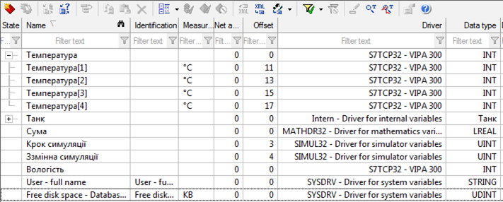

- В нижній частині екрану процесу розмістіть два елементи цифрових покажчиків і прив’яжіть до них створені нами імітаційні змінні
- Проконтролюйте, щоб для елементу зі змінною 'Крок імітації' у властивостях *Write* *set* *value* було активовано бокс *Setting* *values* *active*

Таким чином, оператор зможе в онлайн режимі змінювати крок імітації.

- Біля елементів цифрових покажчиків розмістіть відповідні підписи для орієнтації призначення цих змінних.

Запустіть проект і перевірте зроблену роботу. При  запуску змінна кроку імітації буде одразу мати значення '10', оскільки  це значення за замовчуванням. Змініть його в допустимому діапазоні і  проконтролюйте як змінюється змінна імітації.

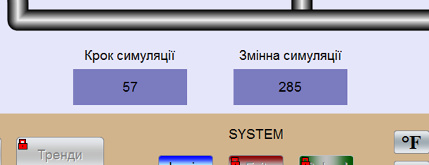

Самостійно створіть та перевірте роботу імітаційних змінних встановлення режиму імітації та діапазону.

Після виконання усіх операцій, описаних в даних навчальних матеріалах, Ваш екран процесу повинен мати такий вигляд:

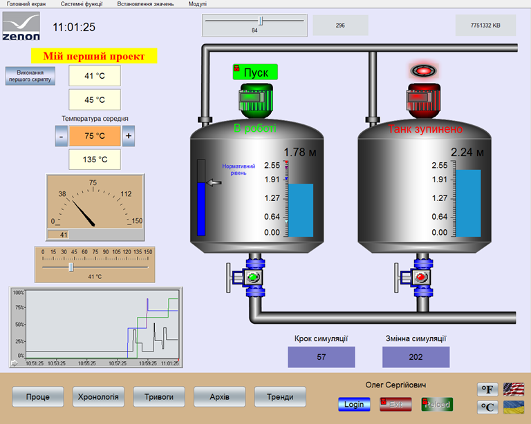

Докладніше про використання математичного драйверу можна прочитати в технічній документації MATHDR32.

Більше інформації про імітаційний драйвер можна знайти в технічній документації SIMUL32.

## Порядок прийому роботи 

Здобувач надає звіт у форматі документу Word, у якому наводяться усі копії екранів та примітки до них  Викладач може перевірити вибірково демонстрацію виконання пунктів лабораторної роботи. 

## Питання до захисту 

1. Яке призначення переназначення (Allocation) в SCADA zenon? Покажіть на прикладі як воно налаштовується?
2. Яке призначення математичного драйверу в SCADA zenon? Від чого залежить значення математичної змінної?
3. Яке призначення системного драйверу в SCADA zenon?  Які системні змінні використовувалися в лабораторній роботі і для чого?
4. Які способи імітації роботи змінних є в SCADA zenon?
5. Розкажіть про налаштування імітаційних змінних в SCADA zenon.
