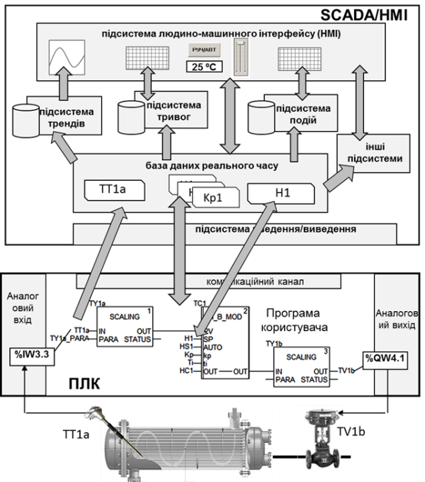
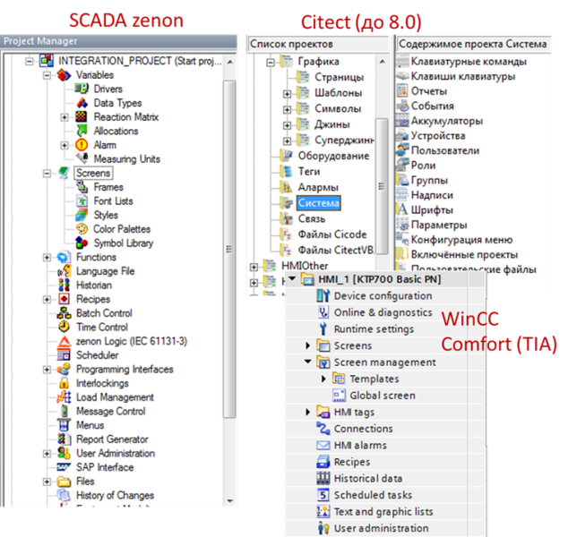
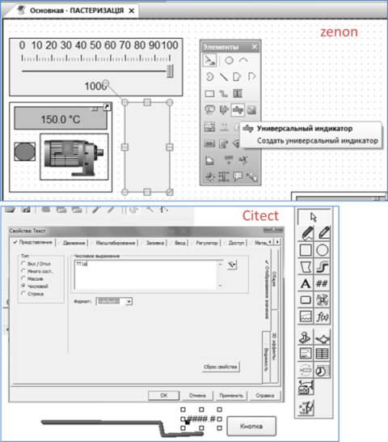
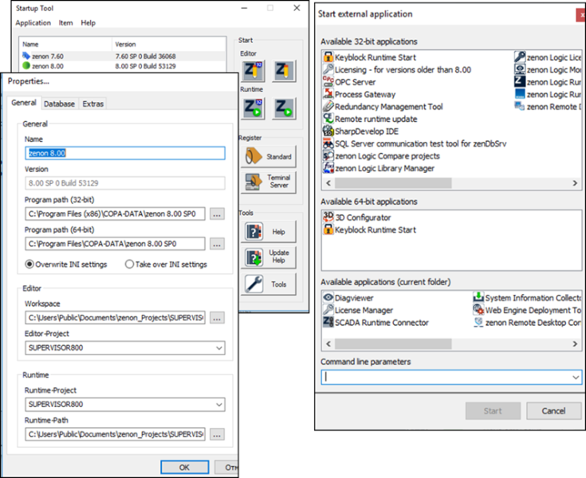
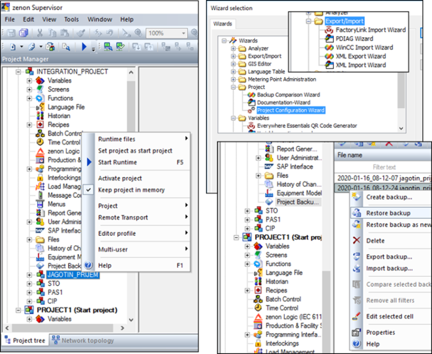
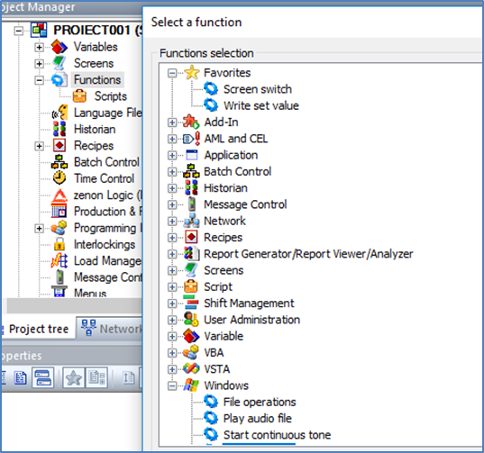
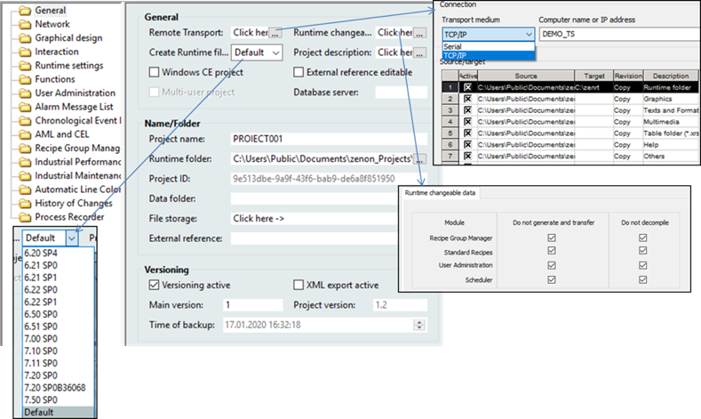
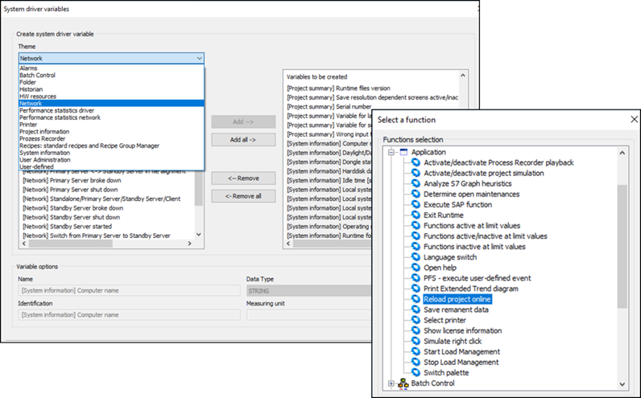
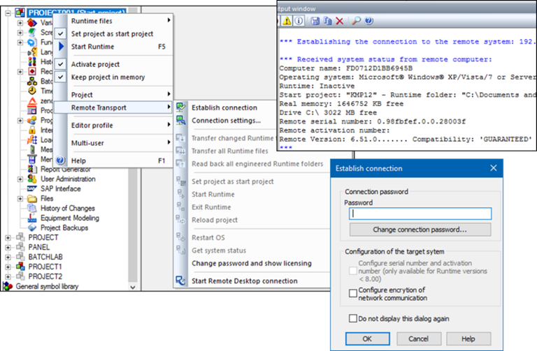

[Моніторинг виробничих операцій](https://pupenasan.github.io/monitorproduction/)  Автор і лектор: Олександр Пупена доц. кафедри [АКСТУ НУХТ](http://www.iasu-nuft.pp.ua/) 

# Лекція 4. Загальні принципи розроблення SCADA/HMI

## 4.1. Загальний опис процесів життєвого циклу програмного проекту SCADA/HMI  

Процеси розроблення SCADA/HMI – це тільки частина робіт у життєвому циклі автоматизованих систем керування. Будь-яка фізична сутність, у тому числі програмна, яка колись планується, з’являється на світ і зникає. Кажуть, що вона проходить свій життєвий цикл. Весь комплекс процесів програмної (і системної) інженерії пов'язаний з упорядкування робіт навколо життєвого циклу. Тобто планування робіт, використання інструментів та інших засобів для створення, зміни, чи обслуговування, перевірку виконання робіт та інші дії розглядають у контексті знаходження програмного продукту на певній стадії життєвого циклу. 

Відповідно до ISO/IEC/IEEE 15288:2015, ***життєвий цикл*** (***ЖЦ***, life cycle) – це розвиток системи, продукції, послуги, проекту або іншої, створюваної людиною сутності від задумки до списання.   Життєвий цикл (ЖЦ) програмних систем включає в себе усі стадії від виникнення потреби в програмі певного цільового призначення до повного завершення використання цієї системи, у зв’язку з моральним старінням або втратою необхідності.  

Життєвий цикл традиційно поділяють на стадії, кожна з яких розглядається як певна закінчена частина роботи, за результатами якої з’являються якісь артефакти (документи, програми, системні компоненти тощо) і приймають якісь важливі рішення щодо інших стадій. Стадії відрізняються за характером робіт. Наприклад, проектування зосереджене на розробленні певного типу документації, за яким проводять реалізацію. Поділ життєвого циклу системи на стадії залежить від її типу та прийнятих правилах у тих організаціях, що її розроблюють. Найпростіше життєвий цикл будь-якої системи можна розглядати як наступні стадії: задум, розроблення, введення в дію, експлуатація, утилізація. Часто розробники систем останню стадію не враховують, вважаючи що після введення в дію та гарантійного терміну експлуатації інше лежить на плечах покупця. 

Засоби SCADA/HMI є частиною системи АСКТП, тому часто їхній життєвий цикл є частиною *ЖЦ* всіє системи. Тим не менше, є певні правила й стандарти, означені саме для SCADA/HMI, а розробниками можуть бути окремі організації. Тому в цьому посібнику ЖЦ для SCADA/HMI розглядається окремо.

Життєвий цикл та стадії проектування SCADA/HMI розглядаються в окремій лекції. Їх варто розглядати після ознайомлення зі способами та засобами, які надаються або можуть надаватися розробникові для реалізації того чи іншого функціоналу. Наразі достатньо розуміти, що для різних стадій та етапів використовуються різні інструментальні засоби, а їх наявність та зручність сильно впливає на їхній вибір та організацію життєвого циклу взагалі. Слід сказати, що на відміну від сектора ІТ, інструментальні засоби проектування, розроблення та супроводження SCADA/HMI далеко не завжди використовують сучасні методи та підходи.

У цій лекції розглядаються такі стадії та етапи з життєвого циклу:

1) стадія розроблення, що включає етапи:

- розроблення програмного проекту SCADA/HMI: тут розглядаються засоби, організація бази даних проектів, створення, редагування, імпорт/експорт, резервне копіювання та відновлення, керування версіями тощо;  

- налагодження: тут розглядаються засоби, компілювання та перевірка на помилки, тестовий запуск тощо; 

2) введення в дію, що включає етапи:

- внесення змін у проект;

- налагодження на ПК розробника;

- введення в дію на цільовій системі: тут розглядаються способи і засоби перенесення проекту на цільову машину, запуск та перезапуск, керування версіями тощо. 

На обох стадіях перші два етапи однакові, але в першому випадку вони робляться в той час, коли ще немає цільової системи або вона ще не готова до введення в дію. Друга стадія проводиться під час пусконалагоджувальних робіт на об’єкті. 

Робоче місце розробника надалі називатимемо ***інженерною робочою станцією*** або просто ***інженерною станцією*** (engineering workstation). Виконання кінцевого проекту проводиться на робочій станції оператора та серверах SCADA, які надалі будемо також називати ***цільовими***.

Програмна структура та процеси розроблення проектів, їх компіляція та розгортання в різних програмах SCADA/HMI мають свої особливості. Слід розуміти, що, на відміну від функціонального призначення, середовища розроблення дуже відрізняються одне від одного. Тим не менше, можна виділити деякі загальні концепції розроблення проектів, спільні для більшості SCADA/HMI. У цьому розділі розглянемо деякі з них. 

## 4.2. Розроблення проекту

### Узагальнена функціональна структура SCADA системи

Як уже зазначалося, загальна концепція розроблення на базі програм SCADA/HMI – це "конфігурування замість програмування". Тобто вся або більша частина проекту розроблюються шляхом заповнення полів, таблиць, розміщення готових елементів. Тільки в деяких випадках, коли немає готового рішення, використовують вбудовані в SCADA/HMI мови та середовища програмування. 

Розробник проекту повинен розуміти внутрішню функціональну структуру SCADA/HMI. Але довідникова система програмних засобів не завжди включає схему та опис такої структури. Набір сутностей та їх взаємозв’язки можуть відрізнятися в різних SCADA/HMI і розробникові без загального "системного" представлення інколи важко зрозуміти, як функціонує середовище виконання і як побудоване середовище розроблення. Тим не менше, враховуючи ринкові вимоги та історичне підґрунтя розвитку SCADA/HMI, перелік функцій середовища виконання для них спільні (вони наведені в попередніх лекціях). Це дає можливість зробити певне узагальнення функціональної структури і саме через нього розглядати спільні риси більшості середовищ розроблення та виконання. На рис. 4.1 наведено спрощену модель функціонування SCADA-системи. Вона може відрізнятися для конкретного програмного пакета в той чи інший бік, тим не менше в цьому посібнику вона є базисною: саме в контексті цієї моделі будуть розглядатися всі діяльності по розробленню.  

*Рис. 4.1.* Спрощена модель функціонування SCADA-системи

Центральне місце в системі збирання та диспетчерського керування займає база даних реального часу (БДРЧ) – сукупність змінних процесу, на базі значень яких функціонують інші підсистеми. Ці змінні часто називають тегами (Tag), і завдання SCADA – слідкувати за їхнім оновленням. З одного боку, теги зв’язуються з джерелом даних, а з іншого – з іншими підсистемами SCADA/HMI. Джерелом даних для тегів можуть слугувати зовнішні пристрої (наприклад контролери), системна інформація (наприклад плинна дата та час, або ім’я оператора, що ввійшов у систему), внутрішня або дискова пам’ять. При створенні та конфігуруванні тегу вказується його унікальне ім’я, тип, джерело даних, періодичність оновлення (зчитування), межі зміни та інші настройки. Наприклад, на рис.4.1 показано, що зовнішній тег з ім'ям “TT1a” через підсистему введення/виведення зв’язується з однойменною змінною на ПЛК, яка має за джерело даних датчик температури, що підключений до вхідного аналогового каналу (%IW3.3). Детальніше конфігурування бази даних реального часу розглядається в третьому розділі посібника. 

Як правило, теги в базах даних реального часу оновлюються періодично. Це робиться для того, щоб отримувати свіжу інформацію від пристроїв введення/виведення, наприклад контролера. Ці значення потрібні іншим підсистемам, наприклад, людино-машинному інтерфейсу. З іншого боку, деякі підсистеми SCADA теж можуть змінювати значення тегів, і при цьому це значення повинно записуватися в контролер. Таким чином реалізується двосторонній обмін. Наприклад, на рис. 4.1 за допомогою повзуна в підсистемі HMI змінюється значення тегу "H1", що прив’язаний до нього. При зміні "H1" підсистема введення/виведення змінює значення однойменної змінної в контролері, яка формує завдання для регулятора "TC1".

Одні й ті самі теги з бази даних реального часу можуть використовуватись одночасно в декількох підсистемах: для відображення та диспетчерського керування (в підсистемі HMI), ведення трендового архіву (підсистема трендів), контролю за значенням (підсистема тривожної сигналізації) та ін. Таким чином, конфігурування кожної з цих підсистем можна розглядати як окреме підзавдання. Однак слід розуміти, що в багатьох випадках зміна налаштувань однієї підсистеми може проводитися через ті самі сутності, що й іншої, а розділення підсистем в SCADA/HMI може не бути.  

Для розроблення, редагування та тестування програмного проекту використовують програмні засоби, які прийнято відносити до середовища розроблення. Середовище розроблення SCADA/HMI – це комплекс інструментального програмного забезпечення, куди входять різноманітні редактори, компілятори, імітаційні засоби, засоби налагодження та утиліти. Хоч не в усіх SCADA/HMI середовище розроблення явно виділяється від середовища виконання, як мінімум режим розроблення повинен бути. Тим не менше, надалі будемо розглядати SCADA/HMI саме в контексті їх розділення на 2 складові: розроблення та виконання. Також будемо вважати, що проект у середовищі розроблення (вихідний) шляхом компілювання перетворюється на проект середовища виконання, хоч не в усіх SCADA/HMI необхідно проводити компілювання. 

Процес створення проекту SCADA/HMI, як правило, проходить у трьох площинах: 

- конфігурування проектних даних; 

- створення графічної частини проекту(HMI); 

- написання невеликих програм (скриптів), якщо в таких є  необхідність. 

Таке розділення пов’язано з різним характером процесів розроблення. Конфігурування проектних даних, як правило, пов’язане із заповненням різноманітних полів таблиць або/та властивостей об’єктів. Графічна частина передбачає створення безпосередньо людино-машинного інтерфейсу, тому включає роботи по рисуванню та налаштуванню анімації. Написання скриптів передбачає програмування на одній або кількох мовах. Хоч ці діяльності пов’язані між собою і переплітаються, для них існують різні редактори. Інтегроване середовище розроблення може включати в себе ці редактори або посилатися на них.

Деякі середовища розроблення за проектними даними можуть автоматично формувати необхідну супроводжувальну для розробників документацію.   

### Структура та принципи побудови середовища розроблення

Можливості середовища розроблення значно впливають на швидкість та зручність розроблення проекту, кількість можливих помилок, допущених при розробленні. 

Проект середовища розроблення містить дані, необхідні для редагування та зв’язування даних у середині проекту. Так, для відображення числового значення тегу в полі необхідно в конкретній властивості цього поля вказати його ім'я, яке є атрибутом цього тегу. Для того щоб при компіляції проекту відбулося таке поєднання, записування про цей тег повинен десь існувати. Той же тег повинен в якості джерела даних отримати змінну з ПЛК, і ці налаштування також десь мають бути записані. Цей ланцюжок зав’язків можна продовжувати, однак очевидно, що проект – це своєрідна база даних. У різних середовищах розроблення SCADA/HMI ця база даних має своє представлення. Наприклад, проект SCADA Citect являє собою папку переважно з файлами Dbase (DBF) та іншими файлами (як правило для опису графічних сторінок). У SCADA zenon проектні дані зберігаються в базі даних MS SQL Server Express. Таким чином, окрім створення, редагування та видалення проектів, для різних середовищ можуть бути доступні різні можливості, зокрема:

- створення та редагування декількох проектів в одному середовищі одночасно;

- створення резервної копії з можливістю її відновлення на іншому робочому місці;

- одночасна робота з проектом з декількох робочих місць;

- імпорт/експорт усього проекту або його частини в/з інші проекти;

- імпорт/експорт проектних даних з інших систем, наприклад через текстові файли CSV, XML або таблиці Excel, тощо; 

- автоматизація роботи з проектом через вбудовані мови та середовища або через спеціалізований програмний інтерфейс;

- засоби налагодження;

- засоби завантаження проекту на цільовий засіб із середовищем виконання;

- засоби кіберзахисту;

- засоби керування версіями; 

- інші засоби.  

Як вже зазначалося, середовища розроблення SCADA/HMI включають кілька редакторів. Як правило, серед них є редактор проектних даних, редактор графіки та редактор коду. Редактор даних призначений для редагування усієї неграфічної частини, а графічна частина проекту виконується в редакторі графіки. У багатьох SCADA/HMI є єдине інтегроване середовище розроблення IDE (Integrated development environment), де редактори графічних сторінок відкриваються в тому самому вікні.   

Сучасні SCADA/HMI як правило мають навігатор проекту або проектів, через який можна швидко доступитися до всіх розділів проекту. На рис. 4.2 показано приклади таких навігаторів, різних за підходами SCADA/HMI. Тим не менше, при детальному розгляді цих структур можна знайти відповідності. Так, в наведених на прикладі середовищах можна знайти розділи:

- теги/змінні;

- налаштування драйверів введення/виведення;

- екрани/сторінки; 

- бібліотечні статичні та динамічні символи; 

- налаштування архівування трендів (Historian);

- налаштування підсистеми тривог та подій (Alarms); 

- планувальники (Scheduler);

- рецепти;

- налаштування користувачів;

- налаштування мов.

*Рис. 4.2.* Приклади навігаторів проекту

Середовища розроблення можуть дозволяти гнучко керувати робочим простором для зручності розробника, зокрема розміщувати вікна, панелі інструментів, підключати інші редактори тощо. Сучасні підходи передбачають можливість одночасно працювати з одним проектом кільком розробникам, що дуже важливо для великих проектів. Для перенесення проектів та керування версіями доступні засоби створення та відновлення резервних копій.  

У різних SCADA/HMI можуть використовуватися принципово різні підходи до використання зв’язків між елементами. Так, у SCADA Citect зв’язки властивостей проводяться під час компіляції. Тобто якщо на якомусь етапі розроблення необхідно буде змінити ім'я тегу, то в усіх полях графічної підсистеми залишиться стара назва, що приведе до прив’язки до неіснуючого тегу. Це у багатьох випадках незручно і призводить до помилок, тим не менше компілятор показує місця цих помилок. Слід відмітити, що у нових версіях SCADA Citect підтримується так звана "каскадна" заміна, коли пов’язані поля за зміни змінюється по всьому проекту. У SCADA zenon принципово інший підхід. Там практично усі зв’язки між елементами формуються не за ім'ям, а за внутрішньо-проектним посиланням. Тобто, якщо зміниться ім'я тегу (змінної), то в усіх місцях, де він до цього використовувався також зміниться назва прив’язки. Хоч це здається завжди зручнішим, інколи бувають випадки, де 1-й спосіб має свої переваги.

Нині усі постачальники намагаються запозичити кращі практики один в одного, що значно спрощує роботу програміста АСКТП. Серед можливостей редакторів можна виділити такі:

- використання фільтрів у табличних редакторах, коли в таблиці відображаються тільки ті записи, що задовольняють умови фільтру;

- одночасне редагування декількох записів, що виділені разом;

- підсвічування різних значень у виділених разом записах. 

Важливим моментом при розробленні великих проектів є можливість імпортувати дані з інших редакторів. Як правило, підтримуються текстові формати даних типу CSV (Comma Separated Value) та XML (eXtensible Markup Language). Файли CSV являють собою текстові записи, в яких поля розділені якимось знаком (";", ",", "TAB" тощо). Такий формат досить зручно використовувати при імпортуванні таблиць з інших редакторів. Враховуючи, що до редакторів, які вміють експортувати CSV, входить Excel, то можливості автоматизації створення SCADA/HMI значно зростають. Навіть якщо формат файлів, що приймає редактор SCADA/HMI, відрізняється від CSV в Excel, то звичайний блокнот з функціями пошуку та заміни легко виправить цей недолік. 

Нині найбільш популярним форматом представлення даних є XML. Він може представити будь-які ієрархічні структури. Тим не менше, в ряді випадків для автоматизації створення великої кількості записів зручнішим видається CSV. 

Для автоматизації розроблення проекту середовище розроблення може мати відкритий програмний інтерфейс API (Application Program Interface). У цьому випадку проектними даними можна оперувати ззовні з використанням різних середовищ програмування. У ряді випадків в IDE SCADA/HMI можуть бути наявні також і засоби такого програмування. Наявність API дає можливість використовувати сучасні підходи автоматизації розроблення та DEVOPS. 

### Створення графічної частини проекту

Графічна частина проекту створюється у вбудованих в SCADA/HMI редакторах. Цей процес полягає у виборі елемента з палітри доступних (рис. 4.3) та конфігурування його властивостей. Властивості елементів, які повинні анімуватися, вказують на той тег, який використовується в анімації. Так, на рис. 4.3 властивість "Числовое выражение" елемента "Текст" вказує на тег "ТТ1а", що в режимі виконання приведе до показу значення цього тегу в цьому елементі.         

*Рис.4.3*. Приклади інструментів для створення людино-машинного інтерфейсу в різних SCADA

Більшість середовищ розроблення SCADA/HMI мають у своєму складі значну кількість бібліотек готових графічних елементів, що дає змогу значно прискорити процес створення проекту. У ряді випадків розробники рисують готову підкладку, яку розміщують на задньому фоні дисплейної мнемосхеми, а вже не неї накладають елементи анімації.  

Використання готових програмних інструментів SCADA/HMI значно прискорює процес розроблення, зменшує кількість проектних помилок, та дає можливість внести зміни в проект у будь-який момент, навіть без зупинки технологічного процесу. Графічна частина стосується практично всіх основних функцій SCADA/HMI. Основні підходи розроблення людино-машинного інтерфейсу розглядаються в іншій лекції.

## 4.3. Виконання та налагодження 

Після створення чергової версії проекту режиму розроблення, його треба налагодити. При розробленні великих проектів налагодження займає велику частину часу стадії розроблення, тому варто потратити певний час для підготовки та організації налагоджувальних робіт та максимальної їх автоматизації. Налагодження передбачає ітераційну процедуру запуску проекту на інженерній станції, перевірки його роботи, внесення змін (повернення до етапу розроблення). Воно включає в себе перевірку правильного виконання усіх функцій проекту. 

Звісно, що для налагодження потребується запуск середовища виконання. Для середовищ виконання SCADA/HMI, що виконуються на ПК, інженерна станція тимчасово виконує роль цільового пристрою. Якщо проект передбачає мережну архітектуру, налагодження може потребувати кількох робочих станцій. У цьому випадку з певними обмеженнями можуть допомогти віртуальні машини, які можна запускати на одній потужній інженерній станції. У випадку, якщо розроблення проекту ведеться для операторських панелей, то потрібна буде підсистема імітації HMI. Імітатори панелей можуть мати певні обмеження, наприклад, щодо комунікацій з фізичними засобами введення/виведення. У будь-якому випадку при розробленні проекту слід добре продумати, яким чином і за яких обмежень працюватиме середовище виконання. У ряді випадків навіть на початкових етапах може знадобитися цільовий пристрій (наприклад ОП), на якому воно буде виконуватися або аналогічний йому. Також можуть знадобитися монітори, аналогічні робочим станціям, або інші компоненти.         

Як видно з рис. 4.1, більшість функцій прямо чи опосередковано зав'язані на базі даних реального часу, тому налагодження передбачає зміну значення тегів (змінних) і перевірка реагування на них. Кілька прикладів:

- для перевірки анімації елемента на графіці треба змінювати значення тегу в певних діапазонах;

- перевірити спрацювання тривоги HIHI та усіх необхідних дій при цьому потребує зміни значення тегу вище від уставки;

- перевірка трендів передбачає зміну значення тегу, по якому ведеться записування.

У більшості випадків тегам треба задавати необхідне значення та візуально спостерігати за результатом. Для цього засоби середовища розроблення та/або виконання мають надавати такі можливості:

- переведення драйверу, або частини підсистеми вводу/виводу в режим, який дозволяє відключитися від джерела даних для можливості їх зміни з HMI;

- набір засобів для контролю стану та зміни значення тегів;

Перша функція робить значення тегів незалежним від джерела даних, друга – дає інструменти для їх зміни. 

На певному етапі життєвого циклу налагодження ПЗ для SCADA/HMI необхідно буде виконувати сумісно з ПЛК. У цьому випадку потрібні комплексні засоби сумісної перевірки, які передбачають спеціальні налагоджувальні режими в самій програмі ПЛК. Деякі підходи описано в [PACFramework](https://github.com/pupenasan/PACFramework).

Для налагодження слід розробляти окремі сторінки, які будуть недоступні операторам на стадії експлуатації. Деякі з них можуть залишатися протягом усього життєвого циклу, але бути доступними тільки авторизованим користувачам. Це можуть бути, наприклад, сторінки з переліком усіх тегів у системі, які надають можливість подивитися їх стан та при необхідності змінити їх значення.   

На етапі налагодження на стадії розроблення і введення в дію можуть знадобитися різноманітні засоби відстеження помилок, які доступні як в ПЗ SCADA/HMI, так і в операційній системі. Це, як правило, журнали, в які пишеться інформація про функціонування та помилки. Наявність таких журналів дає змогу виявити причини, які не є очевидними. Якщо при запуску системи виявляються якісь помилки, які не вдається виправити, то ці журнали можуть бути передані технічній підтримці постачальника для подальшого аналізу причин.    

## 4.4. Введення в дію 

Після налагодження проект необхідно завантажити (розгорнути) і перезапустити на цільовому пристрої. Залежно від SCADA/HMI це може відбуватися в різні способи. Класичним є передача файлів середовища виконання через знімний носій. Цей спосіб не дуже зручний і потребує розуміння файлової структури середовища виконання. Також він може бути небезпечним, бо може створити додаткову загрозу щодо зараження цільової системи вірусом або проникнення туди зловмисного ПЗ. Крім того, перезапуск середовища виконання після цього повинен проводитися вручну. Це значить, що на місці знаходження цільового пристрою повинен бути компетентний спеціаліст, наприклад співробітник КВПіА. Крім того, ця процедура може потребувати від кількох хвилин до кількох десятків хвилин, що може також негативно проявитися на процесі керування.   

Альтернативою знімним носіям може бути передача файлів через відкриті папки цільової системи або файлових серверів у мережі. Такий спосіб більш безпечний і зручніший, але, тим не менше, потребує ручного перезапуску системи розробником за місцем. Наведені вище способи стають ще складнішими в реалізації, коли система передбачає кілька робочих місць або/та серверів SCADA.

Сучасні пакети SCADA/HMI надають механізми підключення до цільової системи через мережу, розгортання та перезапуску. Вони можуть також включати контроль версій, захист від несанкціонованого доступу та шифрування каналів передачі. Наявність таких засобів може стати одним із важливих критеріїв вибору постачальника інструментального ПЗ. 

У будь-якому випадку, з урахуванням доступних засобів, розробник проекту повинен проробити механізми та способи розгортання на цільовій системі враховуючи питання безпеки та зручності.

Введення в дію SCADA/HMI відбувається на стадії пуско-налагодження. Однак за необхідності зміни проекту на стадії експлуатації також необхідно проводити процедуру розгортання та перезапуску. Це спонукає до віддаленого підключення інженерної станції до об’єкта через зовнішні канали зв’язку. Це досить поширена практика як при пуско-налагоджуванні, так і на стадії експлуатації. Класичним підходом до організації віддаленого доступу інженерної станції до мережі з цільовою системою є VPN-тунелі в Інтернет. Не дивлячись на зручність і швидкість реакції на необхідні зміни в проекті, слід розуміти, що при неправильній організації зв’язку і невиконанні правил це може привести до небезпечних ситуацій.

Альтернативним рішенням доступу через VPN є організація використання інженерної станції за місцем з віддаленим підключенням користувача. Тобто на об’єкті передбачено наявність сервісної інженерної станції, яка підключається за необхідністю. Підключення до цільового пристрою SCADA/HMI може відбуватися як по мережі Ethernet, так і через інші канали зв’язку. Інженер-розробник заходить на інженерну станцію через сервіси віддаленого робочого столу, типу RDP, VNC, TeamViewer або аналогічні, використовуючи Інтернет. Ряд з цих сервісів потребують явно виділеної IP-адреси, деякі можуть бути платними.

Слід зауважити, що деякі SCADA/HMI передбачають можливість завантаження проекту виконання без використання середовища розроблення.  

## 4.5. Приклад організації проектів в SCADA zenon

### Основні компоненти середовищ розроблення та виконання 

SCADA zenon (офіційна назва zenon Supervisor) включає в себе ПЗ середовища розроблення (Editor) та середовища виконання (Runtime). Обидва доступні як в 32-бітній так і в 64-бітній версії. Окрім самих середовищ, у комплекті постачається велика кількість утиліт різного призначення. Одна з них – утиліта запуску (Startup Tool), яка дає можливість виконати такі дії (рис. 4.9):
 

*Рис. 4.9.* Вікно запуску та вікно вибору запуску утиліт zenon

- запустити середовище розроблення або виконання з вказаними параметрами (Application Options);

- запустити різні версії zenon, які можуть бути встановлені на одному ПК;

- адміністрування різних екземплярів SQL для тієї самої версії zenon;

- адміністрування налаштувань для різних версій;

- означення мов для середовищ розроблення та виконання перед їх запуском;

- означення мови для ВЕБ-клієнта;

- запуск утиліт з Startup Tool. 

Startup Tool дає зручний інтерфейс для налаштування і запуску середовищ та потрібних утиліт. Частина з цих налаштувань змінюють параметри в файлі "zenon6.ini", який означує режим та особливості роботи середовища розроблення та виконання. На станцію оператора та/або сервер SCADA ставиться тільки середовище виконання, а Startup Tool дає можливість вказати, який проект слід запускати.  

Проект zenon Editor зберігається в базі даних яка керується СКБД SQL Server Express, яка інсталюється разом із середовищем розроблення. Для середовища виконання СКБД SQL Server з базою даних проекту середовища розроблення не потрібні.

### Розроблення проекту

Розроблення проектів проводиться у ***Робочому середовищі*** (***Workspace***), файл якого має розширення .wsp6 і завантажується при старті zenon Editor. В одному Робочому середовищі може бути підключено кілька проектів, в один момент часу активним для редагування є тільки один. Яке Робоче середовище необхідно завантажувати і який проект повинен бути активний при старті zenon Editor – означується в zenon6.ini, і може бути налаштований в Startup Tool (див. рис. 4.9). Після старту zenon Editor можна відкривати інші Робочі середовища та проекти. 

Уся конфігурація бази даних середовища виконання проекту міститься в MS SQL Server Express, який інсталюється на інженерну станцію. Інші файли, що стосуються проекту, зберігаються в папці проекту розроблення, яка знаходиться поряд з файлами бази даних SQL. В одному Робочому просторі може бути створено кілька стандартних проектів та один глобальний. Глобальний проект може слугувати бібліотекою фреймів, символів, стилів та інших для всіх інших проектів, відкритих у Робочому просторі. Кілька проектів в одному Робочому просторі є сенс відкривати за кількох причин, наприклад необхідність копіювання частин проекту або включення кількох проектів в один інтегрований для цілей мультисерверної системи.

 При створенні нового проекту Editor запропонує скористатися помічником конфігурування (Project configuration wizard), який допоможе налаштувати основні властивості проекту, добавити необхідні драйвери, налаштувати розміри екранів, поведінку дисплеїв, розміщення меню, тривожних банерів, добавити потрібні сторінки за шаблоном та за необхідністю демонстраційну частину. Усі ці частини проекту можна створювати самостійно, що розглянуто у відповідних розділах цього посібника. 

SCADA zenon пропонує багато помічників (wizards), які автоматизують процеси розроблення, їх можна викликати через меню Tools середовища розроблення. Також можна створювати свої макроси для автоматизації робіт по проекту в інтегрованих середовищах програмування VBA (Visual Basic for Application) або VSTA (Visual Studio Tools for Applications). 

Ряд операцій з проектами в робочому просторі доступні через контекстне меню проекту (див.рис. 4.10):

- активація (Activate project): проект відкритий для редагування (тільки один проект);
- тримати проект в пам’яті (Keep project in memory): проект відкритий тільки для читання; якщо проект не відкритий для редагування і не в пам’яті, то його вміст не буде відображатися; 
- установити проект як стартовий (Set project as start project): один з проектів вибирається як стартовий, тобто буде запускатися при старті середовища виконання;
- запустити проект на виконання.

   

*Рис.4.10.* Керування проектами.

В один момент часу один проект (з активною опцією Multi-user project) можуть редагувати кілька користувачів на різних інженерних станціях. 

Через розділ проекту "Project Backup" створюються резервні копії, які зберігаються в папці проектів (див. рис. 4.10). Через контекстне меню ці копії можна експортувати (по суті копіювати) в потрібне місце, наприклад, на знімний носій, для перенесення на іншу інженерну станцію. Також у цей розділ можна імпортувати іншу версію резервної копії проекту. У будь-який момент часу можна відновити потрібну копію (Restore backup). Відновити резервну копію можна також через контекстне меню Робочого простору. Якщо необхідно перенести усі проекти Робочого простору, робиться його резервна копія, яку можна також за необхідності відновити. Файли резервних копій – це, по суті, архіви формату *.ZIP.

Діяльність по розробленню проекту передбачає:

- конфігурування проектних даних відповідно до різних підсистем через зміну властивостей об’єктів; 

- створення графічних екранів;

- створення функцій, які проводять певну діяльність при їх виклику.

Робота з конкретними розділами проекту розглядається в інших розділах посібника. Особливістю zenon є повсюдне використання функцій. Вони створюються для виконання певної діяльності, наприклад, відкриття екрану чи записування значення в змінну тощо (рис. 4.11). За великим рахунком, команди, які проводяться в людино-машинному інтерфейсі або в іншому місці, стосуються або змінних, або функцій. Тому в проекті може бути кілька десятків функцій. 

*Рис.4.11.* Функції zenon

Проект має велику кількість властивостей, в яких означуються загальні функції, які стосуються розділів проекту. Деякі з цих властивостей будуть розглядатися в інших розділах посібника, тут зупинимося лише на основних, більшість з яких налаштовуються на вкладці General (рис. 4.12). У групі General та Name/Folder налаштовуються властивості щодо середовища виконання, які розглянуті далі. Через опцію "Versioning active" можна активувати керування версіями, у цьому випадку основний номер версії проекту (Main version) може бути змінений розробником, а додатковий (номер після крапки) – при кожному створенні резервної копії. Номер версії проекту перевіряється при передачі файлів виконання з використанням віддаленого транспорту або через мережну топологію і може бути прочитаний через змінну системного драйвера. Якщо в редакторі і в середовищі виконання при цьому завантажена інша версія, то буде відображатися попередження. Якщо виникає конфлікт під час передачі файлів Runtime через мережу, ви підтверджуєте або відхиляєте передачу для всіх проектів, які передаються на комп’ютер і в яких існують конфлікти. Виставивши опцію "XML export active", можна при створенні резервної копії формувати файл з XML-версіями розділів проекту. 

 

*Рис.4.12.* Основні властивості проекту.

Середовище розроблення zenon дає також можливість вести журнал змін у проекті, активація та деталізація якого налаштовується в розділі "History of changes". 

За допомогою помічника “Documentation Wizard” zenon можна сформувати документацію по проекту у форматі HTML. 

### Виконання та налагодження проекту

SCADA zenon дає можливість компілювати проекти повністю або частково (тільки внесені зміни). Скомпільовані файли на інженерній станції розміщуються в папці, яка задається у властивості проекту “Runtime folders” (див. рис. 4.12). SCADA zenon дає можливість вибрати версію середовища виконання, якщо вона відрізняється від версії редактора, підтримуються версії від 6.20 до актуальної (див. рис. 4.12). Опція “Windows CE project” вказує, що проект розробляється для операторської панелі. 

При компіляції у вікні "Output window" виводяться повідомлення про результати. За замовченням налаштування проекту, чотири файли не будуть компілюватися, тому будуть виводитися відповідні повідомлення про відмову в переписуванні. Опція налаштування компіляції і перенесення цих файлів налаштовується в "Runtime Changeable" (див. інші розділи посібника). У процесі налагоджування компіляція без цих файлів не є критичною, тому на початку на ці повідомлення можна не звертати уваги. У SCADA zenon усі діяльності по створенню створені таким чином, що ймовірність того, що проект не скомпілюється дуже низька.  

Для налагодження в SCADA zenon можна використовувати такі засоби:

- файли журналів, в які записуються повідомлення та помилки, за замовчуванням розміщується в "%ProgramData%\COPA-DATA\LOG";

- діагностична утиліта "Diagnosis Viewer", яка дає можливість журналювати повідомлення та помилки підключеної робочої станції та зручного перегляду журналів;

- системні змінні, які доступні через драйвер введення/виведення SYSDRV (рис. 4.13) і можуть бути використані як для отримання діагностичної інформації, так і для керування системою;

- функції zenon, зокрема Application (див. рис. 4.13);

- спеціальні типи екранів, наприклад Variable Diagnostic.

 

*Рис. 4.13.* Вікно створення системних змінних та вікно вибору функцій Application

Серед функцій групи Application окремо варто виділити "Reload project online", яка дає можливість перезавантажити проект після його зміни без зупинки середовища виконання . 

Для перевірки та зміни тегів є спеціальний тип екрана "Variable Diagnostic", за допомогою якого можна передивитися стан змінних та змінити їх. Драйвери zenon підтримують режим відключення від джерела даних та імітації. Крім того, змінні підтримують режим використання альтернативного значення. 

### Введення в дію

Файли проекту виконання для zenon задаються в zenon6.ini (параметр "VBF30"). Після активації проекту в середовищі розроблення він автоматично відмічається як стартовий, і в zenon6.ini прописується шлях, який вказаний у властивості проекту “Runtime folders” (див.рис. 4.12). Для встановлення параметра "VBF30" на цільовому комп’ютері рекомендується використовувати "Startup Tool".

Після компіляції та налагодження проекту на інженерній робочій станції файли середовища виконання можна передати на цільову систему кількома способами:

- ручним копіюванням файлів у директорію запуску через знімний носій;

- зробивши директорію середовища виконання доступною з мережі та скопіювавши туди файли; 

- використовуючи функціональність системи віддаленої передачі на цільову систему.

Віддалена передача (Remote Transport) дає можливість установити з’єднання з цільовою системою через доступну комунікацію (TCP/IP або послідовний інтерфейс) з метою передачі файлів виконання та керування системою. Параметри віддаленої передачі налаштовуються в однойменних властивостях проекту (див. "Remote Transport" на рис. 4.12). Зокрема, там вказується середовище передачі та адреса або ім’я цільового комп’ютера. У налаштуваннях "Target" вказується папка, куди будуть переміщуватися файли виконання. Налаштування з’єднання можна буде також задати в "Connection settings" перед самим віддаленим підключенням. 

За необхідності передачі файлів на цільову систему спочатку встановлюється з’єднання через пункт контекстного меню проекту “Remote transport”->”Establish connection” (рис. 4.14). Для захисту від несанкціонованого підключення необхідно вказати пароль. При першому з’єднанні цей пароль порожній, його можна задати в меню "Change connection password". Після встановлення з’єднання у вікні "Output window" виводиться інформація про цільову систему та про сумісність проекту з середовищем виконання (див. рис. 4.14)    

 

*Рис. 4.14.* Віддалена передача

Після встановлення з’єднання файли можна передавати на цільову систему або в зворотний бік. Слід відмітити, що при передачі файлів через віддалений транспорт першого разу треба зробити компіляцію всіх файлів, тобто зняти всі опції в "Runtime changeable data"->"Do not generate and transfer", інакше буде видана помилка передачі. Для запуску саме цього проекту в меню віддаленої передачі вказується опція "Set project as start project". Через меню віддаленого транспорту проект можна запускати, зупиняти, перезапускати, а за необхідності перезавантажувати ПК. 

 Для успішної передачі файлів на цільовій системі повинна бути запущена служба ZenSysSrv.exe (за замовчуванням додається в автозапуск при встановленні IDE zenon).  

Команда "Start Remote Desktop connection" викликає доступ до віддаленого керування або контролю робочого столу цільової системи. Перед цим на цільовому ПК необхідно активувати цю опцію і налаштувати через утиліту zenon "Remote Desktop Server configuration". 

[<-- Лекція 3. Інші функції SCADA/HMI](lec3.md)

[--> Лекція 5. Підсистема керування збором та обробкою даних в реальному часі](lec5.md)

## Контрольні запитання 

1.     Поясніть що таке життєвий цикл?

2.     За яким принципом виділяють стадії життєвого циклу?

3.     Роботи яких стадій ЖЦ розглядаються в цьому розділі? Поясніть призначення етапів на цих стадіях.

4.     Що таке інженерна робоча станція, чим вона відрізняється від цільового пристрою?

5.     Поясніть принцип розроблення "проектування замість програмування", що закладені у більшість SCADA.

6.     Які основні роботи проводяться при розробленні проекту в середовищі розроблення?

7.     Що таке проект середовища розроблення, як він може бути побудований?

8.     Як можуть організовуватися зв’язки між елементами? 

9.     Які можливості редакторів Ви можете назвати? 

10.     Які спільні характеристики можна навести для всіх середовищ розроблення?

11.     Розкажіть про можливі функції редакторів.

12.     Покажіть на прикладі однієї з програм SCADA/HMI, як відбувається перенесення проекту режиму розроблення.

13.     Поясніть необхідність імпорту та експорту даних у проектах. 

14.     Як можна використати наявний відкритий програмний інтерфейс (API) у середовищі розроблення?

15.     Розкажіть про загальні підходи до створення графічної частини проекту.

16.     Поясніть, у чому полягає налагодження проекту SCADA/HMI.

17.     Яка відмінність у налагодженні проекту для різних типів цільових пристроїв: ПК та ОП?

18.     Покажіть на прикладі однієї з SCADA/HMI, які засоби використовуються для відображення/зміни значення тегів (змінних) при налагодженні.

19.     Покажіть на прикладі однієї з SCADA/HMI як можна використовувати журнали подій та помилок.

20.     Назвіть кілька способів перенесення файлів виконання із середовища розроблення на цільовий пристрій. 

21.     Покажіть на прикладі однієї з SCADA/HMI, як відбувається перенесення файлів виконання на цільовий пристрій через знімний носій. Які переваги та недоліки такого способу? 

22.     Які переваги та недоліки в перенесенні файлів виконання через мережні папки?

23.     Покажіть на прикладі однієї з SCADA/HMI, як відбувається пересилання файлів виконання на цільовий пристрій через вбудовані засоби розгортання (завантаження).

24.     Назвіть кілька способів віддаленого розгортання (завантаження) та перезапуску проекту їх переваги та недоліки.         

<iframe width="560" height="315" src="https://www.youtube.com/embed/t32T-UU3_Tk" title="YouTube video player" frameborder="0" allow="accelerometer; autoplay; clipboard-write; encrypted-media; gyroscope; picture-in-picture; web-share" allowfullscreen></iframe>

<iframe width="560" height="315" src="https://www.youtube.com/embed/xph0IoO0LJ4" title="YouTube video player" frameborder="0" allow="accelerometer; autoplay; clipboard-write; encrypted-media; gyroscope; picture-in-picture; web-share" allowfullscreen></iframe>

<iframe width="560" height="315" src="https://www.youtube.com/embed/_Q-YVK5_ZVg" title="YouTube video player" frameborder="0" allow="accelerometer; autoplay; clipboard-write; encrypted-media; gyroscope; picture-in-picture; web-share" allowfullscreen></iframe>
