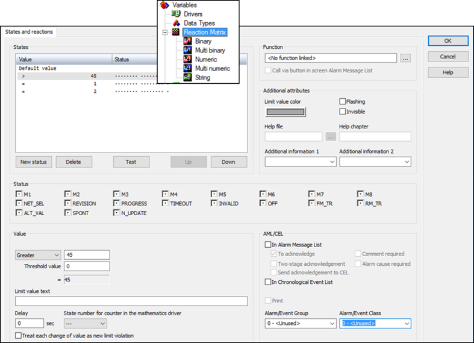
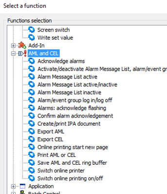

[Моніторинг виробничих операцій](https://pupenasan.github.io/monitorproduction/)  Автор і лектор: Олександр Пупена доц. кафедри [АКСТУ НУХТ](http://www.iasu-nuft.pp.ua/) 

# Лекція 9. Загальні принципи розроблення підсистеми тривог та подій

## 9.1. Підсистеми тривожної сигналізації 

Функції тривожної сигналізації є одними з найважливіших у системах SCADA/HMI, тому входять до комплектності усіх засобів цього типу і нерідко є виділеною підсистемою. Добре пророблені функції запобігають аварійним ситуаціям і можуть не тільки зменшити збитки, а й зберегти життя людей і довкілля. З іншого боку, якщо підсистема або окремі її функції погано реалізовані, то це може звести нанівець усю її роботу. Останнє, на жаль, часто спостерігається на вітчизняних підприємствах, де до розроблення функцій тривожної сигналізації ставляться легковажно. Наступний приклад може здатися багатьом дуже знайомим. 

Класичним способом контролю роботи двигунів є використання в якості зворотного зв’язку додаткових контактів, які замикаються при спрацюванні пускачів. Таким чином система тривожної сигналізації відслідковує сигнал керування та зворотний зв'язок по функції логічного AND з урахуванням затримки часу. На одному з об’єктів, при впроваджені системи АСУТП, замовник узяв на себе частину робіт щодо забезпечення керування та контролю спрацювання двигунів на насосах та інших механізмах, у тому числі роботи з прокладання кабельних проводок та підключення. У результаті виявилося, що на момент пуско-налагоджувальних робіт замовник не виконав цієї частини роботи. Це призвело до великої кількості тривог, які пов’язані з двигунами. Враховуючи, що ці тривоги займали велику кількість повідомлень у журналі, інші тривоги були невидимими й ігнорувалися оператором. Зрештою оператор взагалі не сприймав тривожну сигналізацію, оскільки вона постійно видавала повідомлення. У наведеному прикладі, здавалось би, винуватий замовник, але це не зовсім так. Система керування повинна передбачати механізми відключення (блокування) таких тривог. 

Це тільки один з прикладів недостатньо продуманої підсистеми тривожної сигналізації, однак таких випадків дуже багато. У дослідженнях організації "Управління з охорони праці Великобританії" (HSE) наведено багато прикладів, коли недостатньо продумана система тривожної сигналізації призводила до фатальних наслідків, які супроводжувалися забрудненням довкілля, нанесенням шкоди здоров'ю і, навіть смертю великої кількості людей. Одна з причин – відсутність на той час затверджених в стандартах кращих практик, інша – недотримання існуючих.

У цивілізованому світі до проблеми розроблення ефективної тривожної сигналізації ставляться дуже відповідально, про що свідчить поява стандартів та ряд практичних рекомендацій. Зокрема, щоб спеціалісти, які задіяні в процесі розроблення системи тривожної сигналізації змогли проектувати і розроблювати ефективні АСУТП, в одному з комітетів ISA (International Society of Automation) розроблено стандарт ISA-18.2 "Організація функціонування систем тривожної сигналізації в переробних галузях промисловості" ("Management of Alarm Systems for the Process Industries"). Цей стандарт надає методологію, застосування якої приведе до поліпшення безпеки, якості та функціонування переробних галузей промисловості. Стандарт ISA-18.2 включає практики, викладені в інших стандартах і практичних рекомендаціях. У 2014 році було прийнято стандарт IEC 62682, який є аналогом ISA-18.2.  

Згідно зі стандартом ISA-18.2  ***тривога* (**з англ. ***alarm*),** – це звукові та/або візуальні засоби індикації для оператора про несправність устаткування, відхилення від процесу, ненормальні умови, які потребують своєчасного реагування. Слід сказати, що в зарубіжних та вітчизняних стандартах є інші означення тривоги, зокрема в ДСТУ 3960-2000 та ДСТУ EN 50136-1-1-2014, які дещо відрізняються. Згідно зі стандартом ISA-18.2, сукупність апаратного і програмного забезпечення, яке виявляє стан тривоги, повідомляє про це операторові і записує в журнал зміни стану, називається ***системою тривожної сигналізації*** (**alarm system)**. При цьому наголошується, що оператор є частиною цієї системи. 

Ефективність систем (або підсистем) тривожної сигналізації та інших підсистем з аналогічними функціями, ґрунтується на правильному налаштуванні тривоги. Від цього залежить своєчасне реагування на тривогу та усвідомлення наступних дій, які має провести оператор. Для кращого розуміння правильного налаштування тривог варто розглянути їх через взаємодію оператора з процесом. 

Розробники АСКТП нерідко забувають, що система тривожної сигналізації розроблена саме для оператора, який у даному контурі посідає головне місце. Саме його реакція і дії визначають досягнення цілей функціонування тривог. Система тривожної сигналізації лише допомагає операторові виявити тривогу та надати йому інструменти для швидкого орієнтування в ситуації. Дії щодо виправлення нештатної ситуації він повинен сформувати і провести самостійно. Тому в стандарті ISA-18.2 велику увагу приділяють опису моделі контуру тривоги через взаємодію оператора з процесом (рис. 9.1). 

 

*Рис. 9.1.* Модель контуру тривоги через взаємодію оператора з процесом

Тривога потрібна для усунення оператором або іншою уповноваженою особою нештатної ситуації в тому випадку, коли алгоритми автоматичного керування не передбачають цього. Наприклад, якщо зміна в процесі істотно відхиляється від бажаного стану, а система керування не може це виправити, оператор повинен вжити певних заходів, щоб повернути процес до норми. Якщо устатковання або система керування має несправність, то обслуговуючий персонал повинен вчасно зробити дії щодо її усунення. Будь-яка з наведених ситуацій передбачає, що оператор повинен виявити факт нештатної ситуації, діагностувати її та вжити відповідних дій:  

1) **виявлення** (detect): оператор дізнається про відхилення від бажаного стану або несправності устатковання за допомогою відповідного сигналу тривоги. Структура системи тривожної сигналізації та інтерфейс оператора повинні сприяти виявленню відхилень; 

2) **діагностування** (diagnose): у відповідь на відхилення оператор використовує свої знання та навички для інтерпретації інформації, діагностування ситуації та визначення необхідних коригувальних дій. Діагностувати ситуацію операторові допомагають процедури реагування на тривогу;

3) **реагування** (respond): вживаються коригувальні дії для компенсації збурення. У відповідь на відхилення оператор (або інша уповноважена особа) приймає коригувальні дії і контролює процес, щоб визначити, чи було виправлене це відхилення.

Кожен із цих етапів дуже важливий і потребує окремої уваги на всіх стадіях життєвого циклу системи. Крім того, треба врахувати, що людина в цьому контурі є найбільш непередбачуваною ланкою. На здатність оператора виконувати свої функції впливає багато факторів, у тому числі:

- навантаження;

- ергономіка операторської консолі;

- обмеження пам'яті;

- втома;

- знання;

- мотивація.

При розробленні системи тривожної сигналізації неврахування якогось із наведених факторів може призвести до проблем. Зокрема, кількість активних тривог та частота зміни їх стану можуть стати причиною неефективності роботи системи тривожної сигналізації. Згідно зі стандартом ISA-18.2, ситуація, при якій частота виникнення тривог більша, ніж оператор може їх ефективно опрацювати, називається ***переповненням тривог*** (з англ. ***alarm*** ***flood***). Прикладом переповнення тривог може бути показник частоти більший ніж 10 тривог за 10 хвилин. Для усунення цього негативного ефекту в стандарті 
 ISA-18.2 означено багато механізмів та рекомендацій щодо побудови життєвого циклу організації системи тривожної сигналізації.

Розглянемо контур тривоги в системі як взаємопов’язані функції (рис. 9.2):

- вимірювання значення даних, які необхідно контролювати з об’єкта керування;

- оброблення даних на пристрої збирання (наприклад ПЛК);

- зчитування даних із пристрою збирання та їх оброблення в базі даних реального часу (БДРЧ);

- зчитування даних з бази даних реального часу та їх оброблення в підсистемі тривожної сигналізації; 

- відображення стану та керування тривогами в підсистемі HMI;  

- записування змін стану тривоги в журнал тривог та подій. 

 

*Рис. 9.2.* Деталізована модель тривогового контуру 

На рис. 9.2 підсистема тривожної сигналізації включає в себе тег ALRM, однак це є умовним позначенням, і наявність такого типу тегів залежить від реалізації. Також слід нагадати, що підсистема тривожної сигналізації (позначена як ALARM) може бути реалізована як у вигляді окремого сервера (навіть на окремому ПК), так і не існувати як підсистема, натомість її функції реалізовуватимуть в інших частинах SCADA/HMI.  

Перелічені вище функції формують ланцюжок, який будемо називати ***тривоговим контуром***. Як видно з рис. 9.2, швидкість виявлення спрацювання тривоги залежить від каналу вимірювання, швидкості опитування ПЛК та взаємодії між підсистемами. Діагностуванню в технічному плані можуть допомогти підсистема HMI та додаткові підсистеми. Реагування оператора може проводитись як через підсистеми SCADA, так і безпосередньо через ручні засоби керування (на рис. 9.2 показано бордовими лініями).

## 9.2. Автомат станів тривог

Принципово важливим для означення функцій тривог є формалізація їх автомату станів. На практиці трапляються неодноразові випадки, коли не тільки обслуговуючий персонал, а й розробники не могли чітко пояснити роботу тривог, закладену постачальниками інструментів SCADA/HMI. Іншим типовим випадком є власно придумані автомати станів, або відсутність їх (автоматів) взагалі. **Недостатньо формалізований автомат станів може призвести до неправильного його тлумачення учасниками життєвого циклу підсистеми тривожної сигналізації і може спричинити непередбачувані наслідки!** Навіть якщо в проекті буде реалізовано власний автомат станів, відмінний від стандартного, його треба обов’язково описати в документації у відповідному розділі проекту. У стандарті означення автомату станів є одним із фундаментальних механізмів, на яких ґрунтуються всі інші сутності. 

Тривога може знаходитися в кількох станах, зміни яких можуть бути викликані різними джерелами в системі керування, включаючи польовий пристрій (наприклад, датчики і виконавчі механізми), систему керування (базову чи СПАЗ) та HMI (дії оператора). У стандарті ISA-18.2 наведено діаграму автомату станів тривоги, що показана на рис. 9.3. Стани тривоги представлені на рисунку колами, в яких наводиться опис стану, що включає літерну мітку (ідентифікатор стану), назву стану, опис умови проходження процесу та комбінацію статусів:

- статус тривоги;

- статус підтвердження.

Таким чином, стан – це узагальнюючий показник, який залежить від плинного значення статусів та від попереднього стану. 
            

*Рис. 9.3.* Автомат станів тривог згідно з ISA-18.2

У нижній частині діаграми показано можливі стани блокованих тривог (alarm suppression). Стрілки на рис. 9.3 відповідають переходам між станами. Діаграма не показує безпосередньо вплив зон нечутливостей чи затримок на спрацювання, які включені в оцінку статусу тривоги (тобто активної або неактивної). Більшість із них є очевидними, тому при описі станів прокоментуємо тільки деякі з них. ***Нормальний стан*** (A – Normal, NORM) означується як стан, в якому процес працює в межах нормальних характеристик, статус тривоги не є активним і попередні виникнення тривоги були підтверджені. Стан ***непідтвердженої*** тривоги (B – Unacknowledged state, UNACK) є початковим станом тривоги, що стає активною внаслідок ненормальних умов і є не підтвердженою оператором. Стан ***підтвердженої*** тривоги (C – Acknowledged state, ACKED) – це стан, в якому статус тривоги є активною і оператор її підтвердив. ***Повернена до нормального стану, непідтверджена*** тривога (D – Return to normal unacknowledged state, RTNUN) – це стан, в якому процес вже знаходиться в межах норми, але попередній активний стан тривоги не був підтверджений оператором. 

У стандарті наведений типовий автомат станів, який реалізований у більшості відомих засобів SCADA/HMI. Деякі з інструментальних засобів передбачають два автомати станів: стандартний і без наявності статусу підтвердження.   

Окрім наведених "класичних" станів, стандарт передбачає можливість блокувати тривоги, що повинно убезпечити систему тривожної сигналізації від ефекту переповнення тривог (alarm flood), про який уже згадувалося. Це стани тривоги: відтермінована (Shelved), проектно-блокована (Suppressed-by-design) та виведена з обслуговування (Out-of-service). На цих станах варто зупинитися детальніше, оскільки далеко не всім розробникам АСКТП вони відомі.

Стан ***відтермінованої тривоги*** (E – Shelved state, SHLVD) – це стан, в якому тривога тимчасово блокується оператором, тобто для неї не проводиться оповіщення. Перехід до відтермінованої (будь-який стан → E) відбувається тоді, коли оператор командою з HMI відтерміновує сигнал тривоги, щоб уникнути її появи на дисплеях активних тривог. Відтермінування – ручна операція, а от розблокування (unshelve) може відбуватися як автоматично (після заданого часу), так і вручну оператором. Якщо статус тривоги в цей час активний, перехід повинен здійснюватися до стану непідтвердженої тривоги, а якщо не активна – до нормального стану. Таким чином, функція відтермінування передбачає, що оператор задає час, протягом якого тривога буде заблокована. Система тривожної сигналізації повинна забезпечувати виконання таких функцій:

- можливість відтермінувати тривогу;

- відображення на дисплеях відтермінованих тривог або еквівалентних до них списків;

- задавання часу для відтермінування;

- контроль доступу до відтермінування індивідуальних тривог;

- можливість розблокування тривоги;

- формування в журналах записів про відтермінування.

Стан ***проектно-блокованої тривоги*** (F – Suppressed-by-design, DSUPR) – це стан, в якому тривога блокується з причини певних умов експлуатації або стану установки, і для неї не потрібно проводити оповіщення. Тривога в цьому стані перебуває під контролем логіки, що означує актуальність тривоги. Перехід до стану проектно-блокованої тривоги (будь-який стан → F) відбувається тоді, коли виникли певні умови або стан процесу, які означені в проекті для блокування тривоги. Означене проектом блокування зазвичай є автоматичною операцією. Перехід від проектно-блокованої тривоги до нормального стану або стану непідтвердженої тривоги (F → A або B) відбувається тоді, коли виникли умови або змінився стан технологічного процесу, що означений для розблокування тривоги. Це зазвичай відбувається автоматично. 

Щодо проектно-блокованих тривог система тривожної сигналізації повинна забезпечувати виконання таких функцій:

- відображення проектно-блокованих тривог;

- формування записів в журнал для кожної проектно-блокованої тривоги.

Стан ***виведеної з обслуговування тривоги*** (G – Out-of-service state, OOSRV) – це стан, в якому тривога блокується вручну оператором, як правило, при проведенні технічного обслуговування, і тому в цьому стані не потрібно проводити оповіщення. Тривога в цьому стані перебуває під контролем технічного обслуговування. Виведена з обслуговування тривога – це не те саме, що виведення з обслуговування устатковання або його частини. Устатковання може бути виведене з обслуговування, тоді як відповідні тривоги – ні. Перехід до цього стану (будь-який стан → G) відбувається тоді, коли тривога блокується з метою технічного обслуговування устатковання або з інших причин. Як правило, виведення з обслуговування – це ручна операція. Перехід від стану виведеної з обслуговування тривоги до нормального стану або непідтвердженої тривоги (G → A або B) відбувається, як правило, також вручну, після закінчення обслуговування. 

Для виведених з обслуговування тривог система повинна виконувати функції:  

- індивідуальне повернення кожної тривоги до обслуговування;

- відображення списку на дисплеї зведення виведених з обслуговування тривог або еквівалентного до нього;

- контроль доступу до виведення тривог з обслуговування;

- ведення записування виведення кожної тривоги з обслуговування.

На відміну від класичного автомату станів, механізм блокування не завжди передбачається розробником, що приводить до наслідків, описаних на початку розділу. Не дивлячись на те, що сучасні SCADA/HMI включають ці функції (або принаймні певні з них), їх часто ігнорують розробники АСКТП. 

Слід звернути увагу на те, що назви станів можуть не збігатися у різних інструментальних засобах SCADA/HMI. Очевидно, це пов’язано з тим, що стандарт вийшов порівняно недавно.  

Для узагальнення розуміння автомату станів у стандарті наводиться таблиця станів (табл. 9.1).   

*Таблиця 9.1.* Стани тривоги

| ID   | Ско­рочено | Назва стану                                             | Стан техноло­гічного  процесу | Статус тривоги         | Статус оповіщення | Статус підтвердження |
| ---- | ---------- | ------------------------------------------------------- | ----------------------------- | ---------------------- | ----------------- | -------------------- |
| A    | NORM       | Нормальний                                              | В межах норми                 | Неактивна              | Немає оповіщення  | Підтверджена         |
| B    | UNACK      | Непідтверджена тривога                                  | За  межами норми              | Активна                | Оповіщується      | Непідтверджена       |
| C    | ACKED      | Підтверджена тривога                                    | За  межами норми              | Активна                | Оповіщується      | Підтверджена         |
| D    | RTNUN      | Повернена до  нормального стану непідтвердженої тривога | В межах норми                 | Неактивна              | Оповіщується      | Непідтверджена       |
| E    | SHLVD      | Відтермінована тривога                                  | В межах або за межами  норми  | Неактивна або активна  | Заблоковане       | -                    |
| F    | DSUPR      | Проектно-блокована  тривога                             | В межах або за межами  норми  | Неактивна або активна  | Заблоковане       | -                    |
| G    | OOSRV      | Виведена з обслуговування тривога                       | В межах або  за межами норми  | Неактивна  або активна | Заблоковане       | -                    |

## 9.3. Приклад діаграми поведінки тривоги в часі 

Означення автомату станів – це тільки перший крок для створення вдалої системи тривожної сигналізації. Для правильного налаштування тривог треба розуміти послідовність проходження в тривоговому контурі  етапів у часі. Не слід забувати, що завдання системи тривожної сигналізації – це ***своєчасно*** поінформувати оператора про відхилення, допомогти йому усвідомити причину такого відхилення і максимально допомогти в прийнятті рішення. Якщо оператор не встигне зробити необхідні дії через недостатню усвідомленість, несвоєчасне прийняття дій або з інших причин, то об’єкт може перейти в аварійно небезпечний стан. Для того, щоб краще зорієнтуватися у виборі налаштувань для тривог, у стандарті наводиться приклад діаграми поведінки тривоги в часі (рис. 9.4). На рисунку показано вимірювану технологічну змінну, яка зростає від нормального стану до ненормального (тривожного) за двох можливих сценаріїв, що залежать від того, чи вживає оператор коригувальні дії. 

 

*Рис. 9.4.* Діаграма поведінки тривоги в часі

Розглянемо поведінку через діаграму на рис. 9.3 детальніше. Нормальний стан (A) означується як стан, в якому технологічний процес працює в межах звичайних характеристик. Коли вимірювальне значення перетинає ***уставку тривоги*** (alarm setpoint), вона переходить до стану непідтвердженої (B). Існує кілька факторів, що впливають на оповіщення про тривогу, які не показані на діаграмі, наприклад:

- точність вимірювання (measurement accuracy);

- часовий інтервал вибірки (sampling interval) – періодичність, із якою система тривожної сигналізації отримує вимірювальні значення;

- ***затримка на включення тривоги*** (alarm on-delay) – заданий час, який повинен минути після перевищення уставки тривоги, перш ніж тривога стане активною. 

Сигнал не відразу підтверджується оператором, проходить певний час (затримка до підтвердження, acknowledge delay), після якого оператор підтверджує тривогу, і вона переходить до стану підтвердженої тривоги (C). Оператор може вжити заходів як до підтвердження тривоги, так і після цього. Протягом цього часу тривога знаходиться в активному стані. Фактичний час реагування (з actual response time) для сигналу тривоги – це максимальний час, що проходить між оповіщенням про тривогу і моментом, коли оператор повинен вжити заходів для уникнення наслідків. Фактичний час реагування включає в себе виявлення сигналу тривоги, діагностування ситуації та визначення оператором коригувальних дій, а також виконання цих дій. Верхня межа часу відгуку – допустимий час реагування (allowable response time) – це максимальний час, що проходить між оповіщенням і моментом, коли оператор повинен вжити заходів для уникнення наслідків. Якщо дія не буде виконана за цей час, то наслідки будуть негативними. На рис. затримка реагування оператора (operation response delay) відображається в межах допустимого часу. Існує кілька факторів, які впливають на час реагування оператора (operator response time):

- швидкість оброблення системи тривожної сигналізації;

- конструкція та чіткість засобів HMI;

- обізнаність та підготовка оператора;

- навантаження на оператора;

- складність визначення оператором необхідної дії;

- складність виконання дії операторові.

Результатом правильної дії оператора в межах допустимого часу реагування повинно бути повернення до нормального стану (D). Поріг наслідків (consequence threshold) є значенням змінної процесу, при якому починається виникнення наслідків. Це може відбутися тоді, коли оператор не виконує жодних дій, вживається неправильна або недостатня дія або дія не завершується протягом допустимого часу відповіді. Вплив ***зони нечутливості тривоги*** (alarm deadband) показаний на рис. 9.3 через затримку нечутливості (deadband delay). На рисунку видно, що після перетину уставки тривога повертається до нормального стану не відразу, а лише через певний час. Існує кілька факторів, які впливають на час повернення до нормального стану:

- затримка реагування оператора (operator response delay);

- ступінь вжиття коригувальних дій (degree of corrective action taken);

- час запізнення процесу (process deadtime) у відповідь на коригувальну дію;

- час реагування процесу (process response time) на коригувальну дію;

- точність вимірювання змінної процесу;

- зону нечутливості (deadband) уставки тривоги (alarm setpoint);

- швидкість функціонування системи тривожної сигналізації.

Наведена на рис. 9.4 діаграма дає змогу на всіх етапах життєвого циклу ґрунтовно підійти до вибору правильних налаштувань. Навіть усвідомлення процесів такого вибору без формального їх виконання допомагає розробникові при створенні підсистем тривожної сигналізації.   

## 9.4. Типи, групування та класифікація тривог

При означенні тривог у проекті необхідно чітко знати, з яких причин вони можуть виникати. Враховуючи, що типи умов бувають різними, в стандарті ISA-18.2 означене поняття ***тип тривоги*** (alarm type) – атрибут, який вказує на умову спрацювання тривоги. У табл.9.1 наведено типи тривог, які означені в стандарті ISA-18.2. 

*Таблиця 9.1.* Типи тривог

| Назва українська                  | Назва англійська            | Умова спрацювання                                            |
| --------------------------------- | --------------------------- | ------------------------------------------------------------ |
| абсолютна  тривога                | absolute alarm              | вихід  за уставку тривоги; наприклад, дуже високе, високе, низьке, дуже низьке  значення |
| тривога  відхилення               | deviation alarm             | різниця  між двома значеннями перевищує уставку тривоги; наприклад, відхилення  сигналів вимірювань між первинними та резервними приладами або відхилення між  дійсним та заданими значеннями змінної процесу |
| тривога  швидкості зміни змінної  | rate-of-change alarm        | швидкість  зміни змінної процесу (dPV/dt) перевищує уставку  |
| тривога  невідповідності          | discrepancy alarm           | очікуваний  стан установки або пристрою та його фактичний стан відрізняються; наприклад,  після команди на двигун немає зворотного сигналу про те, що він запустився |
| обчислювальна  тривога            | calculated alarm            | генерується  за розрахунковим значенням, а не за прямим вимірюванням процесу |
| керована  рецептом тривога        | recipe-driven alarm         | вихід  за уставку, що змінюється системою залежно від рецепту, який у даний час  виконується |
| тривога  по бітовому шаблону      | bit-pattern alarm           | шаблон  цифрових сигналів (комбінація кількох бітів) відповідає встановленому |
| тривога  по виходу регулятора     | controller-output alarm     | вихід  за уставку вихідного сигналу алгоритму керування (наприклад, ПІД-регулятору);  на противагу абсолютній тривозі використовується не прямий вимірювальний  сигнал процесу, а вихід  регулятора |
| системно-діагностична  тривога    | system diagnostic alarm     | несправність  у системі апаратного чи програмного забезпечення або компонентів; генерується  системою керування, а не  застосунком; наприклад, комунікаційна помилка |
| тривога  діагностування приладу   | instrument diagnostic alarm | несправність  польового пристрою або його сигналу; наприклад, тривога виходу сигналу за  межі |
| налаштовувана  оператором тривога | adjustable alarm            | вихід  за уставку, яка може бути змінена вручну оператором   |
| адаптивна  тривога                | adaptive alarm              | вихід  за уставку, яка змінюється алгоритмом; наприклад, уставка розраховується на  основі швидкості вироблення продукції |
| повторно  сигналізована тривога   | re-alarming alarm           | після  спрацювання тривоги виникають нові умови для повторного оповіщення |
| статистична  тривога              | statistical alarm           | результат  статистичного оброблення технологічної змінної чи змінних не задовольняє вказаному в умові  тривоги |
| першопричинна  тривога            | first-out alarm             | спрацювання  умови раніше, ніж в інших з вказаної послідовності; наприклад, при вимкненні  кількох одиниць устатковання в короткий проміжок часу одне з них, яке  вимкнулося раніше, буде причиною |
| тривога  помилки вимірювання      | bad-measurement alarm       | сигнал  вимірювальної величини перебуває за межами очікуваного діапазону (наприклад,  3,8 мА для сигналу від 4 до 20 мА) |

Кожен тип потребує окремого розгляду. Не всі з перерахованих типів тривог можуть бути доступними в SCADA/HMI. Крім того, у деяких випадках може знадобитися інший тип тривог, який не входить до переліку табл.9.1. Також дозволяється комбінувати типи.

У системі тривожної сигналізації кількість тривог може сягати сотні й тисячі. Означення таких тривог потребує опису та означення пріоритетів, дій, які необхідно зробити операторові при їх виникненні, правила адміністрування та т. ін. Проведення цих робіт окремо для кожної тривоги займає багато часу і є неефективним. Натомість у стандарті ISA-18.2 рекомендується використовувати класифікацію тривог та означення необхідних параметрів вже не для конкретної тривоги, а для всього класу. ***Клас тривог*** (alarm class) – сукупність тривог із загальними вимогами щодо організації функціонування тривог (наприклад, вимоги до тестування, підготовки, моніторингу та планової перевірки). Приклад класу – тривоги протиаварійного захисту. Одна тривога може входити до кількох класів одночасно, тобто класи можуть перекриватися. 

Крім об’єднання за класом тривог, є сенс їх групувати за ознакою приналежності до устатковання або частини процесу. ***Група тривог*** (alarm group) – набір тривог, які мають спільні взаємозв’язки з частиною технологічного процесу, установкою, набором устатковання або послугою. Використавши в журналах фільтрування тривог за назвою групи, можна спростити і прискорити аналіз причин виявлення відмов як у реальному часі, так і в пост-аналізі.

При виникненні кількох тривог операторові слід швидко визначитися з тим, яку з них необхідно опрацювати першою. Для цього в стандарті означено поняття ***пріоритет тривоги*** (alarm priority) – це відносна важливість, призначена тривозі в системі для позначення терміновості реагування на тривогу (наприклад, серйозність наслідків і допустимий час реагування). При розробленні пріоритети вибираються виходячи з того, що вищі пріоритети призначаються рідше, ніж нижчі. Більша кількість тривог мають найнижчий пріоритет (найменш важливі), а менша кількість – найвищий (найважливіші). Отримані пріоритети потрібно узгодити з наслідками і допустимим часом реагування. Таким чином, тривоги з найнижчим пріоритетом повинні мати найменш тяжкі наслідки і найбільший допустимий час реагування, а найвищого – найсерйозніші наслідки (наприклад, пожежні та сигналізації загазованості) і найменший допустимий час реагування. 

## 9.5. Атрибути тривог

Наведені вище властивості мають бути описані та зконфігуровані в системі для кожної з тривог. Ці властивості означені в стандарті як ***атрибути тривог*** (alarm attribute). Тривоги повинні містити такі атрибути:

- опис тривоги (alarm description): інформативний текст, наданий як опис тегу, або опис тривоги, або їх комбінація;

- уставку тривоги (alarm setpoint) або логічну умову (logical conditions): значення або логічна комбінація, проходження через яке спричинює виникнення тривоги;

- пріоритет тривоги (alarm priority): використовується для надання допомоги операторові у визначенні порядку реагування на тривоги;

- зону нечутливості тривоги (alarm deadband): використовується для зменшення кількості спрацювання тривог для заданого нештатного стану; запобігає поверненню сигналу тривоги до нормального стану, доки умова спрацювання тривоги не пройде через цю зону, означену значенням приросту або відсотком діапазону.

- затримку на спрацювання (on-delay) або затримку на відключення (off-delay) тривоги: використовуються для зменшення частоти спрацювання тривог; затримка на включення використовується для уникнення непотрібних спрацювань тривоги, коли сигнал короткочасно потрапляє в область значень її спрацювання; затримка на виключення, навпаки, утримує тривогу в активному стані, якщо сигнал короткочасно перейшов у зону нормального значення;   

- групу тривоги (alarm group);

- повідомлення тривоги (alarm message).

У найпростішому варіанті системи ці атрибути задаються в підсистемі тривог статично, однак у багатьох випадках їх значення повинні змінюватися оператором або програмно. Необхідність у зміні цих атрибутів може бути пов’язана з типом виготовлюваного продукту або станом технологічного процесу. Атрибути тривог зазвичай можуть бути програмно модифіковані з одного або декількох джерел:

- логіки керування (наприклад, послідовності, етапи, стано-орієнтована логіка);

- прогресивні методи керування тривогами;

- джерело, зовнішнє по відношенню до системи керування (наприклад, система керування виробничими операціями (MES/MOM), система планування ресурсів підприємства (ERP)).

Основні концепції зміни атрибутів тривог, що належить до прогресивних методик описані в підрозділі 6.9. 

## 9.6. Людино-машинний інтерфейс для систем тривожної сигналізації

 Враховуючи, що саме людина є ключовим елементом контуру тривожної сигналізації, велика увага в її організації надається людино-машинному інтерфейсу. Він повинен чітко відображати неблоковані активні тривоги із зазначенням їх станів, пріоритетів, типів та іншої додаткової інформації. Крім відображення, HMI повинен надати можливість операторові здійснювати такі дії:

- індивідуально підтвердити тривогу (квітувати);

- заглушити звукове оповіщення тривоги без дії підтвердження;

- виводити тривоги з обслуговування; 

- змінювати параметри тривог; 

- ініціювати відтермінування тривоги;

- підтримувати функцію проектно-блокованих тривог;

- відображати повідомлення тривог за запитом;

- розмежовувати доступ до функцій різним користувачам.

Для забезпечення цих функцій відображення та дій HMI має надавати певні інструментальні засоби. Стандарт передбачає підтримку, як мінімум, таких засобів HMI:

- дисплей зведення тривог (alarm summary);

- відображення тривог на дисплеях процесів (мнемосхемах);

- відображення (індикація) тривог у дисплеях деталізації тегів;

- дисплей зведення відтермінованих тривог;

- дисплей зведення проектно-блокованих тривог;

- дисплей зведення виведених з обслуговування тривог.

Наведені дисплеї містять відображення стану тривог у вигляді записів. ***Запис тривоги*** (alarm record) – це набір інформації, який документує зміну стану тривоги. Тобто зміна стану тривоги приводить до формування нового запису (в деяких зведеннях – зміни запису попереднього стану). Згідно з 
 ISA-18.2, запис тривоги повинен мати такі атрибути:

- назву тегу для тривоги;

- опис тегу або опис тривоги;

- стан тривоги;

- пріоритет тривоги;

- тип тривоги;

- час і дату зміни стану тривоги.

Окрім цього, рекомендується, щоб запис тривоги мав такі елементи:

- значення змінної процесу в момент записування тривоги;

- уставка тривоги;

- група тривоги або ділянка процесу;

- клас(и) тривоги;

- повідомлення тривоги.

Для однозначного розрізнення станів тривог на HMI A-D (див. рис. 9.3) використовуються комбінації візуальних індикаторів та/або звукових сигналів. У цьому параграфі наведено рекомендації до способів оповіщення, які часто використовуються на практиці. 

Нормальний стан не повинен використовувати звуковий сигнал. Візуальна індикація нормального стану має бути такою самою, як і індикації без тривоги. 

У стані непідтвердженої тривоги слід використовувати як звуковий сигнал, так і візуальну індикацію. Звукове оповіщення повинно відключатися командою придушення або командою підтвердження (ACK) оператора. Візуальна індикація має чітко відрізнятися від звичайного стану за допомогою кольорів і символів (наприклад, форми або тексту). Візуальна індикація для непідтвердженої тривоги повинна включати миготливий елемент. 

Стан підтвердженої тривоги не повинен використовувати звукове оповіщення. Візуальна індикація підтвердженого стану тривоги повинна чітко відрізнятися від індикації звичайного стану (не тривожного) за допомогою символів (наприклад, форми або тексту) і повинна бути пов'язана за кольором з індикацією стану непідтвердженої тривоги. Наприклад, червоний миготливий – для непідтвердженої і червоний – для підтвердженої. У візуальній індикації підтвердженої тривоги не повинен використовуватися миготливий елемент.

Стан повернутої до нормального стану, непідтвердженої тривоги не повинен використовувати звуковий сигнал. Візуальна індикація цього стану може бути такою самою, як і звичайний стан, або може вказувати на непідтверджений стан за допомогою миготливого елемента.

Стан блокованих тривог (відтермінованої, проектно-блокованої та виведеної з обслуговування) може бути показаний у HMI візуальними засобами, явно відмінним способом від інших станів. Звукову сигналізацію використовувати для блокованих тривог не дозволяється.

Рекомендації щодо звукової сигналізації та індикації залежно від станів наведено в табл.6.3. 

*Таблиця 6.3.* **Поведінка звукової сигналізації та індикації в залежності від стану тривог.**

| **Стан тривоги**                                | **Звук** | Візуальна індикація: Колір | Візуальна індикація: Символ | Візуальна індикація: Миготіння |
| ----------------------------------------------- | -------- | -------------------------- | --------------------------- | ------------------------------ |
| нормальний                                      | ні       | ні                         | ні                          | ні                             |
| непідтверджена                                  | ТАК      | ТАК                        | ТАК                         | ТАК                            |
| підтверджена                                    | ні       | ТАК                        | ТАК                         | ні                             |
| повернена до нормального  стану, непідтверджена | ні       | Комбінація                 | Опція                       |                                |
| відтермінована                                  | ні       | Опція                      | н/з                         |                                |
| проектно-блокована                              | ні       | Опція                      | н/з                         |                                |
| виведена з обслуговування                       | ні       | Опція                      | н/з                         |                                |

*Примітка:* н/з показує, що умова не застосовна або не має відношення до стану тривоги; комбінація вказує, що індикація є комбінацією візуальних кольорових і символьних індикацій; опція вказує, що індикація не є обов’язковою.  

Звукова сигналізація для непідтверджених тривог може також використовуватися для зазначення пріоритету, ділянки процесу або групи тривог залежно від означеної методології. У середовищах, де звукова сигналізація не є ефективною (наприклад, середовища з високим рівнем шуму), для непідтвердженого стану тривоги слід використовувати чітку візуальну індикацію, яка завжди знаходиться в зоні оператора.

Для виділення пріоритетних тривог у системі необхідно використовувати візуальні індикатори, звукові сигнали або їх поєднання. Усі станції HMI в системі керування, включаючи відокремлені підсистеми, повинні надавати можливість різної індикації принаймні для трьох різних пріоритетів.   

Для кожного пріоритету тривоги слід використовувати окрему кольорову індикацію, за винятком операційних середовищ, де це не є практичним. Першочергові кольори тривоги повинні бути зарезервовані і не повинні використовуватися для інших елементів HMI.

У стандарті даються рекомендації, прийняті в промисловій практиці. Зокрема, для підсилення виділення пріоритету тривоги, окрім кольорової індикації рекомендується використовувати унікальний символ, наприклад фігуру або текст, а також супроводження звуковою сигналізацією. У середовищах, де звукова сигналізація не використовується як індикатор пріоритету, слід застосовувати тільки візуальну індикацію.

Повідомлення тривоги передбачає подальше уточнення тривоги відображенням назви тегу, стану та пріоритету. Він може також включати частину дії оператора або посилання на процедуру відповіді на тривогу.

Стандартом ISA-18.2 передбачено, що у HMI може бути кілька типів дисплеїв, які можна використати для системи тривожної сигналізації. До них входять: 

- дисплей зведення тривог (alarm summary display): надає список неблокованих активних тривог;

- дисплей зведення статусу тривог (alarm summary status display):показує кількість непідтверджених активних тривог за вибраним пріоритетом для кожної ділянки процесу;

- дисплей журналу тривог (alarm log display): забезпечує доступ до записів тривог в архіві для кожної зміни стану (наприклад, підтвердження, повернення до нормального стану і т. п.);

- дисплей процесу (process display): забезпечує інформацію про тривоги через контекст елементів;

- дисплей інформації про тег (tag detail display): детальний опис тегу тривоги;

- дисплей тривог системної діагностики (system diagnostic alarm display);

- дисплей відтермінованих тривог (shelved alarm display);

- дисплей проектно-блокованих тривог (suppressed-by-design alarm display);

- дисплей виведених з обслуговування тривог(out-of-service alarm display).

## 9.7. Події

Окрім тривог, засоби SCADA/HMI мають можливість вести ***журнал подій***. ***Подія(Event)*** – це штатна зміна значення змінної або виконання команди. Події, за великим рахунком, не потребують означення автомату стану, або точніше, там є два стани: виникнення події і відсутність події. Факт виникнення події потребує фіксації в журналі або у вікні подій. 

Деякі засоби SCADA/HMI не підтримують події, що призводить до певних незручностей. Виходом із такої ситуації може стати використання тривоги. Припустимо, необхідно в такому засобі фіксувати в журналі подію включення певного двигуна. Однак тривога, за означенням, повинна підтверджуватися оператором, що в даному випадку не потрібно і може призвести до затоплення тривог. Припустимо, що система підтримує непідтверджувані тривоги, тобто ті, які мають всього два стани: є тривога і немає тривоги. З першого погляду, це дуже схоже до функціоналу підсистеми подій. Однак у журналі (тривог) будуть фіксуватися дві події, а не одна: тривога виникла і тривога зникла. Ці два записи тільки заплутують оператора при аналізі журналу тривог та подій.     

Для перегляду подій у засобах SCADA/HMI можуть бути передбачені як окремі переглядачі, так і суміщені з переглядачами тривог. 

## 9.8. Підсистема тривожної сигналізації в SCADA zenon

### Загальні принципи функціонування

У SCADA zenon конфігурування функцій сигналізації проходить через конфігурування змінних та загальних групових налаштувань тривог та подій. Означення тривог може відбуватися двома взаємовиключними шляхами:

- через добавлення в зміну граничних значень (Limit values) із зазначенням налаштувань, що належать до тривог та подій;

- через створення матриць реакції, в яких налаштовуються поведінка тривог та подій з подальшою їх прив’язкою до змінних 

Обидва варіанти є частиною процесу конфігурування змінних бази даних реального часу. Тобто в zenon немає явно виділених тегів (змінних) тривог. 

Коли тривога спрацьовує, в спеціально виділену область оперативної пам'яті, яка називається ***кільцевим буфером*** (***Ring buffer***), заноситься запис, для якого робляться усі відмітки проходження тривоги по автомату станів, зокрема:

- час появи тривоги, отриманий у мілісекундах як унікальний підпис;

- додаткова інформація, така як причина, значення тощо;

- час зникнення;

- час підтвердження.

Кожний запис у кільцевому буфері – це активна тривога; як тільки тривога повернулася в нормальний стан – вона видаляється з буфера. Для збереження буфера при вимкненні середовища виконання, він записується в файл "alarm.bin" в директорії середовища виконання.

Одночасно з кільцевим буфером усі тривоги записуються у файл журналу тривог ***Alarm Message List*** *(*AML*)* з розширенням `*.aml`. Цей файл створюється автоматично для кожного календарного дня та керується за допомогою властивості "Save AML data". Ім'я файлу тривоги поєднується з буквою "A", а потім – з датою у формі "JJMMDD" та розширенням ".aml"; наприклад "A100623.aml". Ці файли створюються автоматично на кожен день і повинні бути евакуйовані або видалені користувачем вручну, якщо обсяг пам’яті обмежений. Файли "\*.aml" зберігаються у папці "...\Project folder\Computer name\Project name folder".

Кільцевий буфер використовується для виведення на статусний рядок тривоги (Alarm Status Line) або екран типу Alarm Message List. Останній можна використовувати як для перегляду і взаємодії з буфером, так і з журналом AML. 

Кільцевий буфер та AML зберігають інформацію у вигляді зведення, тобто набір записів, кожен з яких представляє проходження автомату станів. Якщо подію необхідно записувати в журнал у хронологічному порядку її виникнення, то використовується ***Chronologic Event List*** (***CEL***). 

SCADA zenon підтримує кілька автоматів станів для тривог:

- тривоги без необхідності підтвердження; 

- тривоги з необхідністю підтвердження (як в ISA-81.2);

- тривоги з необхідністю двостадійного підтвердження, коли тривога вилучається зі списку активних вручну, навіть коли вона не активна і підтверджена. 

У SCADA zenon є кілька можливостей підтвердження тривог:

- через подвійний правий клік по статусному рядку (alarm status bar) або переглядачі AML;

- через функцію "Acknowledge alarms";

- спеціальну кнопку в переглядачі AML.

Можна сконфігурувати тривоги так, щоб вони потребували обов’язкового коментування перед підтвердженням. Додатковою вимогою може також слугувати попередній вибір причини тривоги (alarm cause). Причини попередньо створюються у вигляді дерева в спеціальних екранах типу "Context List".   

Окрім звичайного підтвердження, в zenon існує можливість робити ***візуальне підтвердження*** *(**Visual acknowledgment**)*. Для цього в екранах типу AML є можливість створити окрему кнопку. Таким чином, в zenon підтвердження може проходити в три етапи:

- візуальне підтвердження;

- підтвердження;

- підтвердження підтвердженого – видалення з кільцевого буфера (при двостадійному підтвердженні);

Хоч в SCADA zenon наявний класичний автомат станів, явної можливості блокувати окремі тривоги немає. Тобто в zenon немає відтермінованих, проектно-блокованих і виведених з обслуговування тривог. Тим не менше, в ньому є можливість блокування тривог за групами або класами, що дає можливість проводити групове блокування, що частково компенсує таку відсутність. Також zenon має можливість індивідуально відключити опитування змінної, через яке також можна реалізувати подібну функцію.

### Означення типів тривог через граничні значення та матриці реакцій 

Класичним способом означення тривог є використання конфігурованих меж змінної, так званих ***граничних значень змінних*** (Limit Values). Для потрібної змінної або типу створюються граничні значення (рис. 9.20) для яких вказується:

- значення змінної, при якому відбувається перехід через межу (Limit Value); значення змінної може задаватися іншої змінною, для цього треба активувати опцію "Dynamic limit value active" та задати змінну уставки значення межі (Variable); 

- текстове значення (Limit value text), яке асоціюється з даною межею, яке може бути використане в анімації на екранах та в переглядачах тривог; в Runtime значення може формуватися динамічно, для чого використовуються спеціалізовані службові символи, зокрема при формуванні тексту можна використовувати:

  - текст з мовної таблиці (language table); 

  - значення інших змінних;

  - деякі властивості змінної;  

- тип межі (Minimum/Maximum), який вказує яка дія є переходом через межу:
  - Minimum – перехід через межу з більшого до меншого значення змінної вважається умовою спрацювання;

  - Maximum – перехід через межу з меншого до більшого значення змінної вважається умовою спрацювання;

- значення гістерезису (Threshold value), тобто відхилення від граничного значення, при якому межа перестане спрацьовувати; наприклад, при межі Limit Value = 100 (Maximum) і Threshold value=10 межа спрацює при 100 і більше, а перестане спрацьовувати при 90 і менше;

- час затримки (Delay time);

- опція використання межі як тривоги (In Alarm Message List);

- опція зберігання в журналі подій та тривог (In Chronological Event List);

- опція необхідності підтвердження (To acknowledge);

- опція обов’язковості вказівки причини тривоги (Alarm cause required);

- опція обов’язковості вказівки коментарю для тривоги (Comment required);

- опція обов’язковості ручного видалення тривоги з кільцевого буфера тривог (Two-stage acknowledgment);

- опція виведення тривоги на принтер (Print);

- віднесення до групи тривог (alarm/event group);

- віднесення до класу тривог (alarm/event class);

- колір, прозорість та миготіння для межі;

- функція, яка може бути викликана при спрацюванні межі або вручну через кнопку на екрані AML (при активній опції "Call via button in screen Alarm Message List");

- файл допомоги (Help file) та розділ у ньому (Help chapter).   
             

*Рис. 9.20*. Налаштування Limit Values 

При переході через граничне значення властивість графічних елементів зміниться відповідно до налаштувань, а в кільцевому буфері та журналі тривог з’являться відповідні записи. Ці налаштування можна задавати для кожної змінної окремо, або задавши їх у типі змінної. 

Є альтернативний варіант конфігурування меж з використанням ***матриці реакцій*** (***Reaction Matrix,ReMa***). Цей підхід передбачає створення матриць реакцій, в яких задаються усі необхідні налаштування для меж, а потім – прив’язують їх до змінних. Матриці реакцій задаються для різних варіантів змінних: Binary, Multi binary, Numeric, Multi numeric, String. На рис. 9.21 показане вікно налаштування для матриці реакцій типу Numeric. Більшість налаштувань такі самі як у конфігуруванні граничних значень. Принциповою відмінністю є те, що умова спрацювання межі задається не через граничне значення, а через комбінацію умов по логічному AND:

- спрацювання умови: більше/менше/рівне за вказане значення, або входить у діапазон;

- відповідає комбінації статусних бітів: для кожного біта задається 0, 1 або будь-яке значення;

- час виконання наведених умов більше за Delay.  
 

*Рис. 9.21.* Налаштування через матрицю реакцій

Для "Multi binary" та "Multi numeric" на вкладці "AML/CEL text" можна означувати додатково окремий текст та активувати запис значення змінної, які будуть добавлятися до тексту повідомлення залежно від бітів статусу. На вкладці "Status Routing" можна сконфігурувати збереження бітів статусу, зчитуючи їх з бітів значення або з інших бітів статусу. Матриці реакції типу “String” дозволяють генерувати реакцію на зміну текстового значення.  

Як бачимо, в zenon тривоги налаштовуються досить гнучко. Хоч явно виділених типів згідно ISA-18.2 в SCADA zenon немає, спробуємо зробити хоча б загальне приведення. Абсолютні тривоги реалізовується штатними засобами як через матрицю реакцій, так і через граничні значення. Враховуючи, що через матрицю реакцій zenon може обробляти значення побітово, достатньо легко можна реалізувати тривоги по бітовому шаблону. Матриця реакцій дає змогу аналізувати статусні біти змінних, що дає можливість реалізувати системно-діагностична тривоги, тривоги діагностування приладу, тривоги помилки вимірювання тощо. Такі тривоги, як тривога відхилення, тривога невідповідності, обчислювальна тривога потребують додаткових внутрішніх та математичних змінних. Зрештою те, що не реалізується безпосередньо, завжди можна зробити через вбудовану систему скриптів. Зведені варіанти реалізації типів ISA-18.2 в SCADA zenon показані в табл. 9.7. Слід зазначити, що це є авторським представленням суто для кращого розуміння читачем і не є офіційною позицією COPA DATA. 

*Таблиця 9.7.* Варіанти реалізацій типів тривог ISA-18.2 в SCADA zenon 

| **Назва (англ./ укр.)**                                      | **Засоби реалізації**     | **Варіанти реалізації**                                      |
| ------------------------------------------------------------ | ------------------------- | ------------------------------------------------------------ |
| absolute alarm/  абсолютна тривога                           | Limits або ReMa           | задаванням  абсолютних меж, гістерезису, таймауту            |
| deviation alarm/  тривога відхилення                         | Limits або ReMa           | створенням  внутрішньої змінної через математичний драйвер, значення якої дорівнює  різниці значень змінної та уставки |
| rate-of-change alarm/  тривога швидкості зміни змінної       | Limits або ReMa           | через  внутрішні та математичні змінні а також з використанням переприсвоєння (Allocation); можна зробити через скрипти |
| discrepancy alarm/  тривога невідповідності                  | ReMa                      | через  внутрішню змінну та/або бітову матрицю                |
| calculated alarm/  обчислювальна тривога                     | Limits або ReMa           | створенням  внутрішньої змінної через математичний драйвер, значення якої розраховується  відповідно до вимог |
| recipe-driven alarm/  керована рецептом тривога              | Limits                    | через  динамічне значення межі, значення якої змінюються модулем Batch, при відключеній процедурі задаються завідомо в значенні що не є  тривогою (окремий Limit) |
| bit-pattern alarm/  тривога по бітовому шаблону              | ReMa                      | в  ReMa задається бітова маска                               |
| controller-output alarm/  тривога по виходу регулятора       | Limits або ReMa           | задаванням  абсолютних меж вихідної змінної, гістерезису, таймауту |
| system diagnostic alarm/  системно-діагностична тривога      | система,  Limits або ReMa | через  системні повідомлення; через системні змінні          |
| instrument diagnostic alarm/ тривога  діагностування приладу | ReMa                      | через  системні біти статусу змінної, деякі беруться з пристроїв |
| adjustable alarm/  налаштовувана оператором тривога          | Limits                    | через  динамічне значення межі, значення якої задається через внутрішню змінну  оператором |
| adaptive alarm/адаптивна  тривога                            | Limits                    | через  динамічне значення межі, значення якої задається через змінну, яка змінюється  алгоритмом |
| statistical alarm/статистична  тривога                       | Limits або ReMa           | через  математичний драйвер                                  |
| first-out alarm/  першопричинна тривога                      | ReMa                      | можна  забезпечити через варіанти групового блокування тривог |
| bad-measurement alarm/  тривога помилки вимірювання          | ReMa                      | через  системні біти статусу змінної, деякі беруться з пристоїв |

Як уже зазначалося, у zenon штатними засобами не передбачено індивідуального блокування тривог. Однак можна використовувати спеціальні функції для групового блокування, зокрема “Activate or deactivate alarm/event groups/classes” або змінивши змінну статусу для групи чи класу. Заблоковані активні на момент блокування тривоги продовжують змінювати свої стани (можна підтверджувати, вони переходять до нормального стану), але нові записи в кільцевому буфері і в AML не з’являються. Автору не відомі прямі способи фільтрування тривог за блокованими групами, однак можна відслідкувати стан груп/класів.   

У zenon доступно багато інших функцій роботи з тривогами (рис. 9.22)  

 

*Рис. 9.22*. Функції для керування тривогами

### Кільцевий буфер та AML 

Як написано вище, кільцевий буфер зберігає записи активних тривог. Тривоги видаляються з буфера у випадку: 

- якщо вона не потребує підтвердження: коли перейшла в неактивний статус;

- якщо для тривоги стоїть атрибут "З підтвердженням" ("To acknowledge"): коли перейшла в неактивний статус і підтверджена користувачем;

- якщо для тривоги стоїть атрибут "Двоступеневого підтвердження" ("Two-stage acknowledgement"): коли перейшла в неактивний статус, підтверджена користувачем і явно видалена оператором з буфера.

На відміну від кільцевого буфера, записи ніколи не видаляються з AML, змінюється тільки їхній статус. Розмір кільцевого буфера повинен бути встановлений через однойменну властивість проекту (“Size of the ring buffer”), який вказує на максимальну кількість записів у ньому (рис. 9.23). Рекомендується вказувати розмір рівним принаймні кількості змінних, для яких налаштована тривога.
 

*Рис. 9.23.* Налаштування кільцевого буферу

Коли Runtime закривається, кільцевий буфер автоматично зберігається у файлі alarm.bin. Якщо Runtime закривається несподівано, наприклад, при відключенні живлення, записи будуть втрачені. Щоб запобігти цьому, кільцевий буфер можна зберігати постійно при створенні нового запису, виставивши опцію "Save ring buffer on change at every new entry". Альтернативою є запуск функції "Save AML and CEL ring buffer" (Зберегти кільцевий буфер AML та CEL). 

Файл тривоги `*.aml` зберігається щоразу, коли створюється новий запис. Файл AML синхронізується з кільцевим буфером. Усі зміни типу підтвердження здійснюються лише в кільцевому буфері, а потім синхронізуються з файлом AML. Якщо виставлена опція "Save AML data" = “Ring buffer and historic data”, то одночасно зі збереженням кільцевого буфера буде збережений файл "*.aml". 

Якщо кільцевий буфер переповнюється, оскільки він занадто малий, у файлі тривоги залишаються непідтверджені записи. Вони відображаються під час фільтрації, але їх більше не можна підтвердити. Спроба підтвердити їх може спровокувати підтвердження в кільцевому буфері, якщо тривоги стосуються тієї самої змінної та того самого порушення граничного значення.

### Класифікація та групування тривог

У zenon тривоги можуть бути згруповані та пріоритизовані через (рис. 9.24):

- логічне групування через групи тривог/подій (Alarm/event groups);

- класифікація за пріоритетом для кольорового кодування тривог в AML і подій в CEL (Alarm/event classes);

- групування за розміщенням на виробничому майданчику (Alarm areas). 
 

*Рис. 9.24.* Групування тривог у zenon

Налаштування груп, класів та ділянок проводиться в розділі проекту Variables->Alarm (див. рис. 9.24). Кожній групі чи класу можна присвоїти ім’я, число, колір, функцію, змінну стану, графічний символ та групу устатковання (equipment group), до якої вони належать. 

***Класи тривог/подій*** (***Alarm/event classes***) зазвичай використовуються для пріоритизації тривог. Для цього в класі задається колір (рис. 9.25), яким буде позначатися текст в переглядачах AML/CEL для всіх тривог цього класу. Окрім кольору, можна вказати символ, яким буде позначатися даний клас тривог. При виникненні тривоги даного класу можна запустити функцію. Статус класу тривог можна прив’язати до булевої змінної статусу ("Status variable"). У цьому випадку змінна може бути використана як для контролю, так і для керування блокуванням тривог даного класу. Заблокувати тривоги вказаного класу або групи можна також за допомогою функції "Alarm/event group connection active/inactive". Явно виділеного номера пріоритету в zenon немає, однак в переглядачах AML/CEL можна упорядковувати повідомлення за вибраним класом або групою, що по суті одне й те саме.   
 

*Рис. 9.25.* Налаштування груп, класів та ділянок для тривог у zenon

Окрім класифікації за пріоритетом, можна об’єднувати тривоги в логічні ***групи тривог/подій*** (***Alarm/Event Group***). Тривоги можуть бути організовані в групи за різним принципом, наприклад, за типом устатковання і за своїм призначенням, що більше схоже на клас тривог, означений в ISA-18.2. Для груп тривог/подій характерні ті самі налаштування, за винятком кольору, який стосується не тексту повідомлення а тільки спеціального індикатора у відповідній колонці переглядача AML/CEL. 

Для групування за розміщенням на виробничій площадці використовуються **ділянки тривог** (***Alarm areas***). Ділянки так само як і класи та групи можуть використовуватися для фільтрування відображення тривог у переглядачах AML/CEL. Однак, окрім цього, ділянки мають можливість формувати загальну статистику для всіх тривог та по кожному класу окремо. Для цього в розділі "Aggregated alarms" (див. рис. 9.25) задаються змінні:

- статусна змінна (Status variable): байтова змінна, в першому біті якої вказується 1, якщо є активні тривоги, у другому – якщо є непідтверджені;  

- для відображення кількості активних тривог (Number of active alarms); 

- для відображення кількості непідтверджених тривог (Number of unacknowledged alarms).

Подібне налаштовується для кожного класу тривог, який підключений до ділянки, що дає можливість проводити статистику за кожним класом тривоги окремо. 

Класи та групи тривог/подій прив’язуються в змінних (див. рис. 9.20) або матрицях реакцій (див. рис. 9.21). Приналежність до ділянки може вказуватися двома шляхами:

- статично, прив’язавши змінну безпосередньо до потрібних ділянок (максимум до чотирьох); 

- ієрархічно через модель устатковання (Equipment Modelling).

Перший спосіб передбачає пряме означення належності змінної конкретній ділянці тривог через властивості Alarm handling (рис. 9.26). Другий спосіб (при виставленій опції "Use hierarchical alarming of the Equipment Model") приналежності буде визначатися налаштуванням ієрархії устатковання.  

     

*Рис. 9.26*. Прив’язка змінної до ділянок тривог

Додатково у групі параметрів "Alarm handling" можна налаштувати дві змінні, які будуть встановлюватися в задане в полі "Acknowledgement value" значення:

- "Acknowledgement variable" при підтвердженні тривоги; 

- "Visual acknowledgement variable" при візуальному підтверджені тривоги.

### Відображення на дисплеї подій та тривог

Для відображення активних тривог та журналів використовуються як готові типи сторінок, так і додаткові засоби. Для активних тривог використовуються екран типу AML та ***статусний рядок тривоги*** (***Alarm status line***). Статусний рядок – це смуга на екрані, що знаходиться над усіма вікнами, в якій відображається одна активна непідтверджена тривога. Подвійний клік правою кнопкою миші підтверджує видиму тривогу. 

Для AML та статусного рядку в групі властивостей проекту "Alarm Message List" є ряд налаштувань (рис. 9.27):

- активація функції AML;

- властивості за замовчуванням: вибір колонок на екрані AML та їх ширини;

- поведінка миготіння елементів на звичайних екранах та AML;

- вибір використання кольору як фону чи як тексту;

- налаштування вибору причин тривоги;

- для кожної події (received – активація, cleared – перехід у норму, acknowledged – підтвердження) означення кольору та текстового префіксу відмітки часу, графічного символу статусу (як альтернативи кольору), графічного символу префіксу (як альтернатива текстовому);

- кольору та символу для стану підтвердженої тривоги при двостадійному підтвердженні.
 

*Рис. 9.27.* Загальні налаштування AML та кільцевого буферу

Додатково можна активувати статусний рядок тривоги (див. рис. 9.22), для якого вказується:

- порядок (найстаріший, найновіший) відображення тривог у рядку;

- повідомлення, що будуть з’являтися, якщо досягнута певна кількість тривог у буфері.

Для відображення усіх активних тривог за вказаними критеріями (фільтрами) використовуються екрани типу “Alarm Message List” (рис. 9.28). За призначенням вони відповідають "alarm summary display" з ISA-18.2 і можуть відображати як зміст кільцевого буфера, так і певну кількість записів AML (рис. 9.29). Відповідно до ISA-18.2, AML відображає всю обов’язкову інформацію, за винятком хіба що пріоритету, оскільки його в явному вигляді в zenon немає. Однак, якщо вважати, що клас тривоги еквівалентний пріоритету, то це не так принципово.  
 

*Рис. 9.28*. Приклад екрану AML 

 

*Рис. 9.29.* Налаштування фільтрів AML

На сторінці AML доступні наступні функції:

- упорядкування тривог за хронологічним порядком та за будь-яким іншим стовпцем;

- підтвердження виділеної тривоги (подвійний клік правою кнопкою миші) або всієї сторінки чи всіх тривог, що задовольняють фільтрам;

- візуальне підтвердження;

- підтвердження підтвердженого (для тривог з двохстадійним підтвердженням);

- виклик файлу допомоги за тривогою;

- виклик прив’язаної функції, наприклад для навігаційного посилання на відповідний екран процесу;

- фільтрація тривог за різними параметрами (див. рис. 9.29), в тому числі за:

- типом тривог;

- часом;

- групами тривог;

- класами тривог;

- ділянкою процесу;

- приналежністю до ієрархії устатковання;

- іменем або ідентифікатором змінної;

- внесення коментарю;

- вибір причини тривоги;

- збереження користувацьких налаштувань відображення як профіль з можливістю його завантаження;

- добавлення та видалення колонок зі сторінки;

- друк, експорт та імпорт сторінки.

Інші типи екранів, що вимагаються в ISA-18.2, за винятком дисплеїв блокованих тривог, також доступні в zenon і наведені в табл. 9.8. Хоча стандартних засобів перегляду блокованих тривог немає в zenon, їх можна реалізувати самостійно, хоч це не є тривіальним завданням. За іншим варіантом реалізації блокування може проводитися з використанням контролера.

*Таблиця 9.8.* Засоби zenon для реалізації різних типів сторінок 

| **Дисплеї    ISA-18.2 (англ)**                               | **Засоби** **zenon** **(укр./англ.*)**                       | **Призначення  та способи реалізації**                       |
| ------------------------------------------------------------ | ------------------------------------------------------------ | ------------------------------------------------------------ |
| alarm summary display                                        | екран  активних тривог/Alarm Message List; режим відображення буферу | відображаються  останні тривоги з кільцевого буферу та AML (див. рис. 6.36); реалізовуються через типи екранів AML |
| alarm summary status display                                 | стандартні  екрани + змінні статистики за ділянками процесу (Alarm handling) | відображаються  статистичні дані по кожній ділянці (Area); реалізуються  через змінні, означені властивостях "Alarm handling" |
| alarm log display                                            | екран журналу  подій/ Chronological Event List (CEL);        | відображаються  тривоги та події CEL у  вигляді хронології подій; реалізовуються через типи екранів CEL |
| alarm log display                                            | екран  активних тривог/Alarm Message List; режим відображення AML | відображаються  тривоги у вигляді зведення;  реалізовуються через типи екранів AML |
| process display                                              | стандартні  екрани                                           | змінюється  візуальне представлення та текст; реалізовуються через використання граничних значень або ReMa |
| system diagnostic alarm display                              | екран  активних тривог/Alarm Message List                    | відображаються  усі активні апаратні (системні) тривоги; реалізовуються з використанням  фільтрів, наприклад, за групою тривог; попередньо створюються системні змінні  та тривоги для них |
| shelved alarm display,  suppressed-by-design alarm display, out-of-service alarm display | немає в zenon                                                | можливо,  реалізовується через скрипти (VBA,  VSTA)          |

### Ведення журналів подій та тривог (CEL) 

Для записування подій і тривог у хронологічному порядку в zenon використовується Chronological Event List (CEL). Туди можуть заноситися такі події (список неповний):

- зміна стану тривоги;

- видалення тривоги;

- установлення значення;

- виконання, зміна рецепта; 

- архівування даних;

- різні дії оператора (наприклад, реєстрація);

- мережні дії.

У CEL також є тимчасовий кільцевий буфер (cel.bin), який містить останні кілька записів (означується в налаштуваннях). Усі останні записи з буфера записуються у файли архіву (з розширенням *.cel). Поведінка та налаштування кільцевого буфера аналогічні кільцевому буферу тривог.  

CEL активується і налаштовується в однойменній групі властивостей проекту (рис. 9.30). Зокрема там вказується:

- налаштування колонок на екрані типу CEL за замовчуванням;
- необхідність автоматичного оновлення змісту екрана CEL;
- вибір використання кольору як фону чи як тексту;
- розмір кільцевого буфера; 
- налаштування необхідності записування у файл історії при кожній події;
- налаштування необхідності фіксувати в CEL:
- подій підтвердження тривог та підтвердження підтвердженого;
- внесення коментарю в CEL та AML;
- виконання функції записування значення змінної;
- виконання/зміни рецепта та записуваних значень;
- змін у списку контексту;
- внесення змін в архів CEL.  

 

*Рис. 9.30.* Налаштування CEL у властивостях проекту

Фрагмент прикладу екрану CEL показано на рис. 9.31. Він має ті самі функції налаштування і фільтрування, що й AML, однак не дає змоги керувати тривогами.   
 

*Рис. 9.31*. Фрагмент екрану CEL

[<-- Лекція 10. Загальні принципи розроблення підсистеми тривог та подій](lec10.md)

[--> Лекція 12. Розроблення підсистеми трендів](lec12.md)

## Контрольні запитання 

1.    Які дисплеї тривог використовуються для системи тривожної сигналізації? Покажіть на прикладі однієї з програм SCADA/HMI, які типи дисплеїв тривог підтримуються. 

[<-- Лекція 8. Анімовані компоненти та навігація](lec8.md)

[--> Лекція 10. Розроблення підсистеми трендів](lec10.md)

# Контрольні запитання 

1.    Поясніть важливість стандартів на розроблення підсистем тривожної сигналізації. 

2.    Які міжнародні стандарти є базовими для розроблення систем тривожної сигналізації?

3.    Що таке тривога? Як оператор може дізнатися про тривогу?

4.    Що таке система тривожної сигналізації відповідно до означення ISA-18.2/IEC 62682? Чому людина є частиною цієї системи?

5.    За рис. 9.1 поясніть взаємодію системи тривожної сигналізації з іншими системами.

6.    Яку роль у системі тривожної сигналізації відіграє оператор?

7.    В які етапи проходить ідентифікація нештатної ситуації та проведення коригуючих дій оператором?

8.    Які людські фактори впливають на здатність оператора виконувати свої функції? 

9.    Поясніть, що таке переповнення тривог. Наведіть приклади.

10.    Які функції формують тривоговий контур?

11.    Поясніть, що таке автомат станів тривоги. Чому важливо зосереджуватися на автоматі станів при розробленні та експлуатації систем керування?

12.    Поясніть призначення кожного стану з автомату станів тривог та умови переходів між станами.

13.    Розкажіть про призначення та поведінку тривог у станах блокування.

14.    Прокоментуйте діаграму поведінки тривоги в часі, яка показана на рис. 9.6.

15.    Яке призначення затримки на включення тривоги? Покажіть на прикладі однієї з програм SCADA/HMI, де вона задається. 

16.    Яке призначення зони нечутливості тривоги? Покажіть на прикладі однієї з програм SCADA/HMI, де вона задається.

17.    На що вказує тип тривоги? Покажіть на прикладі однієї з програм SCADA/HMI, які типи тривоги підтримуються.

18.    Назвіть кілька типів тривог та поясніть, за якими умовами вони спрацьовують.

19.    Для чого використовуються класи тривог?

20.    Для чого використовуються групи тривог? Покажіть на прикладі однієї з програм SCADA/HMI, як можна групувати тривоги.

21.    Для чого використовуються пріоритети тривог? 

22.    Які атрибути повинні містити тривоги? 

23.    Наведіть приклади, коли атрибути тривог повинні змінюватися під час роботи.

24.    Які можливості повинен надавати HMI для користувачів? 

25.    Які засоби HMI відповідно до стандарту ISA-18.2 повинні надаватися для реалізації функцій тривог? 

26.    Що таке запис тривоги? Які атрибути повинен містити запис тривоги?

27.    Які рекомендації даються в стандарті ISA-18.2 щодо проведення оповіщення для різних станів тривог?

28.    Які рекомендації даються в стандарті ISA-18.2 щодо використання миготіння та блимання для тривог?

29.    Які рекомендації даються в стандарті ISA-18.2 щодо використання звукового сповіщення для тривог?

30.    Які рекомендації даються в стандарті ISA-18.2 щодо використання кольору та додактових символів для тривог?

31.    Які дисплеї тривог використовуються для системи тривожної сигналізації? Покажіть на прикладі однієї з програм SCADA/HMI, які типи дисплеїв тривог підтримуються.

32.    У чому особливість подій порівняно з тривогами? З якими труднощами може зустрітися розробник при реалізації подій у вигляді тривог?

<iframe width="560" height="315" src="https://www.youtube.com/embed/rSC2jqMZKwc" title="YouTube video player" frameborder="0" allow="accelerometer; autoplay; clipboard-write; encrypted-media; gyroscope; picture-in-picture; web-share" allowfullscreen></iframe>

